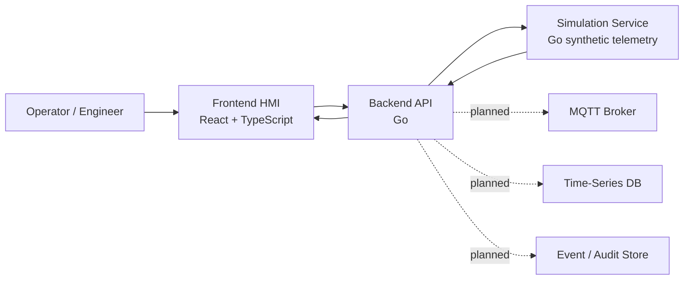

# SMR Twin Platform

Simulation-only digital twin platform for SMR energy systems. No real plant control.

SMR Twin Platform is a modular digital twin simulator for portfolio and educational industrial software work. The project demonstrates HMI-style frontend engineering, Go backend architecture, synthetic simulation, telemetry contracts, alarms, scenarios, optional PostgreSQL/TimescaleDB historian persistence, Docker-based local development, and safety-conscious system boundaries.

The current MVP has two explicit domain levels:

- **SMR Unit Overview**: high-level synthetic unit metrics such as power, primary temperature, coolant flow, turbine speed, and generator load.
- **Thermal Process Loop MVP**: lower-level training loop used as the base for future valve, pump, PID, command, telemetry, and alarm work.

```text
Tank -> Pump -> Control Valve -> Heat Exchanger -> Sensors -> PID Controller -> HMI
```

> This project is a simulation and educational engineering platform. It is not a nuclear plant control system and must not be used for safety-critical automation, real facility integration, or real reactor operation.

## Implemented Now

- Monorepo structure for `apps`, `services`, `packages`, `infra`, `docs`, and `scripts`.
- React + TypeScript frontend shell with Dashboard, Process, Alarms, Events, Trends, and Settings pages.
- Go API service with health, system status, assets, latest telemetry, history, alarm lifecycle, event, command, and scenario proxy endpoints.
- Go simulation service with deterministic synthetic telemetry, scenarios, active alarm generation, in-memory fallback history, and optional PostgreSQL/TimescaleDB historian writes.
- Docker Compose stack for `web`, `api`, `simulation`, and local TimescaleDB/PostgreSQL.
- Polling-based live telemetry from frontend to API.
- Dashboard overview backed by live API status, synthetic telemetry, active alarms, alarm history, command history, and recent events.
- API proxy from backend to simulation service, with clearly labelled in-memory fallback data for selected endpoints.
- Basic synthetic scenarios such as normal, startup, load ramp, high temperature, pressure deviation, pump degradation, sensor drift, and trip.
- Alarm lifecycle for synthetic alarm instances: `ACTIVE`, `ACKNOWLEDGED`, and `CLEARED`.
- Alarm history for synthetic alarm instances, persisted when the historian is enabled.
- Unified recent event stream for command, alarm, equipment, and simulation events.
- In-memory telemetry history for trend charts.
- Process asset cards backed by the API assets endpoint, with labelled fallback states.
- Trends summary cards backed by latest API telemetry and chart history backed by persistent historian data when available, with in-memory fallback.
- Simulation-only command layer for `V-101` and `P-101` through the API gateway.
- Simulation-only `TIC-101` control modes for command arbitration: `MANUAL`, `AUTO`, and `DISABLED`.
- Command arbitration for direct `V-101` commands, with `AUTO` assigning authority to the simulation-only `TIC-101` PID controller.
- Simulation-only `TIC-101` PID controller for the synthetic `TT-101 -> V-101.POS` thermal loop.
- Valve `V-101` and pump `P-101` state machines that update synthetic telemetry.
- Command history and event/audit trail for simulation command attempts, persisted when the historian is connected and kept in memory as fallback.
- Persistent historian status endpoint and minimal Dashboard/Trends/Settings historian source labels.
- Frontend valve and pump control panels with pending, success, and error states.
- GitHub Actions CI quality gates for Go API, Go simulation, frontend, and Docker Compose config validation.
- Playwright Chromium smoke test for the core browser flow across Dashboard, Process commands, Alarms, and Events.
- OpenAPI 3.1 contract and JSON Schema reference files under `packages/schemas`.
- Generated frontend API schema types committed under `apps/web/src/shared/api/generated`.
- TanStack Query frontend data layer with typed REST hooks, query keys, polling intervals, and mutation invalidation.
- Runtime API validation in the frontend HTTP client for dev/test contract drift detection, including control mode payloads.
- Explicit safety boundary in docs and UI copy.

## Partially Implemented

- **Alarms**: active, acknowledged, and cleared alarm workflow exists in memory. Shelving, persistent audit, and production operator workflow are planned.
- **Trends**: PostgreSQL/TimescaleDB-backed telemetry history exists when the historian is enabled. In-memory history remains the fallback. Downsampling APIs and long-range query controls are planned.
- **Events**: command, alarm, control, PID, scenario, and simulation events are captured in memory and persisted when the historian is connected. This is still not a production audit archive.
- **Process UI**: process-loop values are bound to live API telemetry when available. Valve and pump controls call simulation-only command endpoints; `TIC-101` mode controls whether direct valve commands are allowed.
- **Scenario controls**: predefined synthetic scenarios can be started/stopped through the API. Declarative YAML/JSON scenario definitions are planned.
- **Assets**: API exposes current simulation assets and fallback process-loop assets. Persistent asset registry is planned.
- **API contract layer**: OpenAPI and generated TypeScript types exist for core DTOs. Frontend runtime validation exists for selected dev/test request and response payloads; Go server code generation is not implemented yet.

## Planned Next

- Alarm shelving and richer operator workflow.
- MQTT bridge for simulated telemetry.
- WebSocket or SSE real-time transport.
- Report export.
- Auth/RBAC.
- Observability dashboards.

## Not Implemented Yet

- MQTT broker or MQTT ingestion.
- Kafka, Redpanda, or NATS.
- InfluxDB, Redis, or MinIO persistence.
- Production auth/RBAC.
- PDF/Excel report export.
- Kubernetes or Helm deployment.
- Real nuclear plant interface.
- Safety-critical automation.

## Current Architecture



The frontend calls only `apps/api`. The simulation service remains an internal backend dependency so the API layer can later add auth, audit, rate limiting, observability, persistence, and transport changes without forcing frontend contract churn.

## Domain Levels

### SMR Unit Overview

High-level synthetic unit telemetry for dashboard and trend validation:

- `SMR-POWER`
- `THERMAL-MW`
- `ELECTRIC-MW`
- `TT-PRIMARY`
- `PT-PRIMARY`
- `FT-COOLANT`
- `TURBINE-RPM`
- `GEN-LOAD`

### Thermal Process Loop MVP

Lower-level process-loop tags used by the HMI mnemonic and future command layer:

- `T-101` tank
- `P-101` pump
- `V-101` control valve
- `HX-101` heat exchanger
- `TT-101` loop temperature
- `PT-101` loop pressure
- `FT-101` loop flow
- `LT-101` tank level
- `TIC-101` manual/auto/disabled arbitration status and simulation-only PID output telemetry

See [MVP Domain Model](docs/mvp-domain-model.md) for the current contract and planned extensions.

## Safety Boundary

- Simulation-only platform.
- No real nuclear plant control.
- No safety-critical automation.
- No real reactor operating procedures.
- No connection to real plant networks or physical actuators.
- Simulation commands apply only to in-memory simulated assets.
- Manual/auto/disabled mode changes apply only to in-memory `TIC-101` simulation state.
- `AUTO` mode lets the simulation-only `TIC-101` PID controller apply an in-memory `V-101.POS` target.
- Command history, event records, alarm lifecycle, and telemetry history store only synthetic simulation data. When PostgreSQL/TimescaleDB is enabled, the persistent historian is for demo, learning, and portfolio use only.
- Alarm acknowledge/clear actions apply only to synthetic in-memory alarm instances.
- UI and API copy must preserve the distinction between monitoring, simulation, advisory concepts, and real control.

## Technology Stack

| Area | Current / planned stack |
| --- | --- |
| Frontend / HMI | React, TypeScript, Vite, Tailwind CSS, shadcn-style UI primitives, Recharts, TanStack Query |
| Backend | Go, REST, structured logging, simulation gateway |
| Simulation | Go synthetic telemetry engine |
| Messaging | MQTT planned, not implemented |
| Data | In-memory fallback plus optional PostgreSQL/TimescaleDB historian for synthetic telemetry/events/commands/alarms |
| DevOps | Docker, Docker Compose, Makefile |
| Security | Safety boundary and in-memory command audit now; auth/RBAC and persistent audit planned |

## Repository Layout

```text
apps/
  web/          React HMI and engineering UI
  api/          Go backend core
  simulation/   Go simulation-only telemetry engine
services/
  telemetry/    future telemetry ingestion service
  historian/    optional PostgreSQL/TimescaleDB write/read layer inside simulation service
  alarm/        future alarm engine service
packages/
  proto/        shared protocol definitions
  schemas/      shared DTO and event schemas
  ui/           shared UI primitives
infra/
  docker/       Docker-related local infrastructure
  k8s/          future Kubernetes manifests
docs/           architecture, product vision, domain model, safety notes
scripts/        automation and helper scripts
```

## How To Run

Start the current local stack:

```bash
make dev
```

Equivalent explicit command:

```bash
make dev-up
```

Stop the local stack:

```bash
make down
```

Run checks:

```bash
make test
make lint
```

Run individual services locally:

```bash
make api-run
make simulation-run
make web-build
```

## CI Quality Gates

The repository includes a GitHub Actions workflow at `.github/workflows/ci.yml`.
It runs on `push` and `pull_request` and checks the current simulation-only MVP without deploying or starting the full stack.

Automated CI jobs:

- **API**: `go test ./...` and `go vet ./...` in `apps/api`.
- **Simulation**: `go test ./...` and `go vet ./...` in `apps/simulation`.
- **Web**: `npm ci`, `npm run typecheck`, `npm run lint`, and `npm run build` in `apps/web`.
- **API types**: `npm run api:types` regenerates frontend contract types before frontend checks.
- **API schemas**: `npm run api:validate-schemas` compiles JSON Schema contract files.
- **Compose**: `docker compose config --quiet` from the repository root.
- **E2E Smoke**: starts the Go simulation and API services, launches the Vite frontend through Playwright, and runs the Chromium smoke flow.

## Frontend Data Layer

The frontend API layer uses the generated OpenAPI TypeScript types with a small typed REST client and TanStack Query hooks.

Current behavior:

- `VITE_API_BASE_URL` configures the API gateway URL, with `http://localhost:8080` as the local fallback.
- Live simulation data still uses REST polling, not WebSocket or SSE.
- Query keys are centralized in `apps/web/src/shared/api/query-keys.ts`.
- Mutations for simulation-only commands, alarm acknowledgement, and scenarios invalidate related telemetry, alarm, event, command, and scenario queries.
- Runtime API validation can run in `warn` or `strict` mode for selected request/response payloads.

Local equivalents:

```bash
cd apps/api
go test ./...
go vet ./...

cd ../simulation
go test ./...
go vet ./...

cd ../web
npm run api:types
npm run typecheck
npm run lint
npm run build

cd ../..
docker compose config --quiet
```

## E2E Smoke Tests

Playwright smoke tests live in `apps/web/tests/e2e`.

The current smoke verifies:

- Dashboard loads with live platform sections.
- Process page loads with valve, pump, and flow telemetry.
- `V-101` accepts a simulation-only set-position command.
- `P-101` accepts a simulation-only start command after normalizing state if needed.
- Events page shows command-related entries and filters remain usable.
- Alarms page loads active/history sections and can acknowledge an active alarm when one exists.

Local commands:

```bash
cd apps/web
npm run test:e2e:install
npm run test:e2e
npm run test:e2e:headed
npm run test:e2e:ui
```

For local runs, API and simulation should be reachable at `http://127.0.0.1:8080` and `http://127.0.0.1:8081`; the Playwright config starts only the Vite frontend dev server. CI starts the Go backend services before running the smoke.

## API Contract / Schemas

The current REST API contract is documented in:

- `packages/schemas/openapi.yaml`
- `packages/schemas/schemas/*.schema.json`

Frontend contract types are generated into:

- `apps/web/src/shared/api/generated/schema.ts`

Regenerate frontend API types from `apps/web`:

```bash
npm run api:types
```

Verify that committed frontend API types are still current:

```bash
npm run api:types:check
```

This contract layer is documentation and frontend type source for the current API gateway. Frontend dev/test runtime validation is implemented for selected request and response payloads. Generated Go server stubs and Go runtime validation from JSON Schema are not implemented yet.

## Runtime API Validation

The frontend HTTP client validates selected API payloads against JSON Schema during development, tests, and CI.

Modes are controlled by `VITE_API_RUNTIME_VALIDATION`:

- `off`: validation is disabled.
- `warn`: validation errors are written to `console.warn`, and UI flow continues.
- `strict`: validation errors throw `ApiValidationError`, so React Query and Playwright can catch contract drift.

Default behavior:

- local development defaults to `warn`;
- production builds default to `off`;
- the CI Playwright smoke job runs with `VITE_API_RUNTIME_VALIDATION=strict`.

This is a dev/test contract-hardening layer, not a production security gateway. Backend command and alarm handlers still perform their own request validation for simulation operations.

## Available Services

| Service | URL |
| --- | --- |
| Web HMI | http://localhost:5173 |
| API | http://localhost:8080 |
| Simulation service | http://localhost:8081 |

Current Docker Compose services:

- `web`
- `api`
- `simulation`

No database, MQTT broker, Redis, Grafana, or object storage service is included in this milestone.

## Available API Endpoints

API gateway:

```bash
curl http://localhost:8080/health
curl http://localhost:8080/api/v1/system/status
curl http://localhost:8080/api/v1/assets
curl http://localhost:8080/api/v1/telemetry/latest
curl "http://localhost:8080/api/v1/telemetry/history?window=15m"
curl http://localhost:8080/api/v1/control/status
curl -X POST http://localhost:8080/api/v1/control/mode \
  -H "Content-Type: application/json" \
  -d '{"mode":"AUTO","requestedBy":"demo-operator","reason":"Enable simulation-only PID demo"}'
curl http://localhost:8080/api/v1/pid/status
curl -X PATCH http://localhost:8080/api/v1/pid/config \
  -H "Content-Type: application/json" \
  -d '{"setpoint":288,"kp":0.9,"ki":0.05,"kd":0.1,"requestedBy":"demo-operator"}'
curl http://localhost:8080/api/v1/alarms/active
curl http://localhost:8080/api/v1/alarms/history
curl -X POST http://localhost:8080/api/v1/alarms/alarm-id/acknowledge \
  -H "Content-Type: application/json" \
  -d '{"acknowledgedBy":"demo-operator","comment":"Acknowledged from API"}'
curl -X POST http://localhost:8080/api/v1/commands \
  -H "Content-Type: application/json" \
  -d '{"targetTag":"V-101","commandType":"SET_POSITION","payload":{"positionPercent":75}}'
curl "http://localhost:8080/api/v1/commands/recent?limit=50"
curl "http://localhost:8080/api/v1/events/recent?limit=50"
curl http://localhost:8080/api/v1/simulation/scenarios
curl -X POST http://localhost:8080/api/v1/simulation/scenarios/high_temperature/start
curl -X POST http://localhost:8080/api/v1/simulation/scenarios/stop
curl -X POST http://localhost:8080/api/v1/simulation/reset
```

Simulation service, usually called through the API:

```bash
curl http://localhost:8081/health
curl http://localhost:8081/api/v1/simulation/status
curl http://localhost:8081/api/v1/simulation/telemetry/latest
curl http://localhost:8081/api/v1/simulation/control/status
curl -X POST http://localhost:8081/api/v1/simulation/control/mode \
  -H "Content-Type: application/json" \
  -d '{"mode":"MANUAL","requestedBy":"demo-operator"}'
curl http://localhost:8081/api/v1/simulation/pid/status
curl -X PATCH http://localhost:8081/api/v1/simulation/pid/config \
  -H "Content-Type: application/json" \
  -d '{"setpoint":288,"kp":0.9,"ki":0.05,"kd":0.1,"requestedBy":"demo-operator"}'
curl http://localhost:8081/api/v1/simulation/alarms/active
curl http://localhost:8081/api/v1/simulation/alarms/history
curl -X POST http://localhost:8081/api/v1/simulation/alarms/alarm-id/acknowledge \
  -H "Content-Type: application/json" \
  -d '{"acknowledgedBy":"demo-operator","comment":"Acknowledged from simulation API"}'
curl -X POST http://localhost:8081/api/v1/simulation/commands \
  -H "Content-Type: application/json" \
  -d '{"targetTag":"P-101","commandType":"START","source":"frontend","requestedBy":"demo-engineer"}'
curl "http://localhost:8081/api/v1/simulation/commands/recent?limit=50"
curl "http://localhost:8081/api/v1/simulation/events/recent?limit=50"
```

## Known Limitations

- Live UI transport is polling, not WebSocket/SSE.
- Telemetry history can persist to PostgreSQL/TimescaleDB when the historian is enabled; otherwise the simulation service uses in-memory fallback history.
- Command history, event records, and alarm history can persist to the local demo historian when connected, but this is not a production compliance archive.
- Alarm active state remains simulation-owned and synthetic; persisted alarm history stores demo lifecycle records only.
- Command support is limited to simulated `V-101` valve and `P-101` pump assets.
- Command arbitration currently applies primarily to the `TIC-101` / `V-101` control loop; `P-101` remains manually controllable.
- `AUTO` mode lets the simulation-only `TIC-101` PID calculate an in-memory `V-101.POS` target.
- Events are simulation records backed by the historian when available, with in-memory fallback if the DB is disabled or unavailable.
- Data source switching in UI is not a real runtime integration switch yet.
- Frontend uses route-level code splitting; deeper vendor/chart chunk tuning can be added later if needed.
- Dashboard data is live for the local simulator, but it still uses REST polling and synthetic simulation sources.
- Runtime validation is dev/test focused and currently lives in the frontend HTTP client; Go runtime validation from JSON Schema is not implemented yet.
- Go server/client code generation is not implemented yet.
- The simulation is synthetic and intentionally not a real reactor physics model.

## Roadmap

1. Stabilize architecture truth, domain levels, live process UI, and dev commands.
2. Add simulation-only command layer for valve and pump with event/audit trail.
3. Add OpenAPI schemas, generated frontend types, React Query API layer, runtime validation, and Playwright smoke coverage.
4. Harden API contract tooling, simulation domain boundaries, and quality gates.
5. Add persistent historian storage for telemetry, events, commands, and alarm history.
6. Add MQTT bridge for simulated telemetry.
7. Add retention/downsampling and richer trend query controls.
8. Add report export.
9. Add auth/RBAC, observability, deployment hardening, and extended CI checks.

## Documentation

- [Project Vision](docs/project-vision.md)
- [MVP Domain Model](docs/mvp-domain-model.md)
- [Architecture Notes](docs/architecture.md)
- [Safety Boundary](docs/safety-boundary.md)
