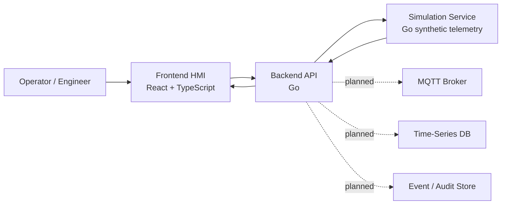

# SMR Twin Platform

Simulation-only digital twin platform for SMR energy systems. No real plant control.

SMR Twin Platform is a modular digital twin simulator for portfolio and educational industrial software work. The project demonstrates HMI-style frontend engineering, Go backend architecture, synthetic simulation, telemetry contracts, alarms, scenarios, in-memory history, Docker-based local development, and safety-conscious system boundaries.

The current MVP has two explicit domain levels:

- **SMR Unit Overview**: high-level synthetic unit metrics such as power, primary temperature, coolant flow, turbine speed, and generator load.
- **Thermal Process Loop MVP**: lower-level training loop used as the base for future valve, pump, PID, command, telemetry, and alarm work.

```text
Tank -> Pump -> Control Valve -> Heat Exchanger -> Sensors -> PID Controller -> HMI
```

> This project is a simulation and educational engineering platform. It is not a nuclear plant control system and must not be used for safety-critical automation, real facility integration, or real reactor operation.

## Implemented Now

- Monorepo structure for `apps`, `services`, `packages`, `infra`, `docs`, and `scripts`.
- React + TypeScript frontend shell with Dashboard, Process, Alarms, Trends, and Settings pages.
- Go API service with health, system status, assets, latest telemetry, history, active alarms, and scenario proxy endpoints.
- Go simulation service with deterministic synthetic telemetry, scenarios, active alarm generation, and in-memory history.
- Docker Compose stack for `web`, `api`, and `simulation`.
- Polling-based live telemetry from frontend to API.
- API proxy from backend to simulation service, with fallback mock data for selected endpoints.
- Basic synthetic scenarios such as normal, startup, load ramp, high temperature, pressure deviation, pump degradation, sensor drift, and trip.
- Basic active alarm display generated from synthetic simulation thresholds.
- In-memory telemetry history for trend charts.
- Explicit safety boundary in docs and UI copy.

## Partially Implemented

- **Alarms**: generated active alarms and UI display exist. Acknowledge endpoints, cleared alarm history, shelving, and operator workflow are planned.
- **Trends**: in-memory simulation history exists. External TSDB persistence, downsampling APIs, and long-range queries are not implemented yet.
- **Events**: dashboard has mock event previews. A full event service and event log page are planned.
- **Process UI**: process-loop values are bound to live API telemetry when available. Controls remain disabled until the simulation command layer exists.
- **Scenario controls**: predefined synthetic scenarios can be started/stopped through the API. Declarative YAML/JSON scenario definitions are planned.
- **Assets**: API exposes current simulation assets and fallback process-loop assets. Persistent asset registry is planned.

## Planned Next

- Simulation-only command layer for `V-101` and `P-101`.
- Valve and pump state machines.
- Event and audit trail for simulation commands.
- Alarm acknowledge/clear endpoints and alarm history.
- Full event log page and event service.
- MQTT bridge for simulated telemetry.
- PID control module and manual/auto arbitration.
- Persistent historian with PostgreSQL/TimescaleDB or another time-series store.
- WebSocket or SSE real-time transport.
- Report export.
- Auth/RBAC.
- Observability dashboards.

## Not Implemented Yet

- MQTT broker or MQTT ingestion.
- Kafka, Redpanda, or NATS.
- PostgreSQL, TimescaleDB, InfluxDB, Redis, or MinIO persistence.
- PID controller.
- Real command endpoints for actuators.
- Production auth/RBAC.
- PDF/Excel report export.
- Kubernetes or Helm deployment.
- Real nuclear plant interface.
- Safety-critical automation.

## Current Architecture



The frontend calls only `apps/api`. The simulation service remains an internal backend dependency so the API layer can later add auth, audit, rate limiting, observability, persistence, and transport changes without forcing frontend contract churn.

## Domain Levels

### SMR Unit Overview

High-level synthetic unit telemetry for dashboard and trend validation:

- `SMR-POWER`
- `THERMAL-MW`
- `ELECTRIC-MW`
- `TT-PRIMARY`
- `PT-PRIMARY`
- `FT-COOLANT`
- `TURBINE-RPM`
- `GEN-LOAD`

### Thermal Process Loop MVP

Lower-level process-loop tags used by the HMI mnemonic and future command layer:

- `T-101` tank
- `P-101` pump
- `V-101` control valve
- `HX-101` heat exchanger
- `TT-101` loop temperature
- `PT-101` loop pressure
- `FT-101` loop flow
- `LT-101` tank level
- `TIC-101` PID controller placeholder

See [MVP Domain Model](docs/mvp-domain-model.md) for the current contract and planned extensions.

## Safety Boundary

- Simulation-only platform.
- No real nuclear plant control.
- No safety-critical automation.
- No real reactor operating procedures.
- No connection to real plant networks or physical actuators.
- Commands, when added, will apply only to simulated assets.
- UI and API copy must preserve the distinction between monitoring, simulation, advisory concepts, and real control.

## Technology Stack

| Area | Current / planned stack |
| --- | --- |
| Frontend / HMI | React, TypeScript, Vite, Tailwind CSS, shadcn-style UI primitives, Recharts |
| Backend | Go, REST, structured logging, simulation gateway |
| Simulation | Go synthetic telemetry engine |
| Messaging | MQTT planned, not implemented |
| Data | In-memory now; PostgreSQL/TimescaleDB planned |
| DevOps | Docker, Docker Compose, Makefile |
| Security | Safety boundary now; auth/RBAC/audit planned |

## Repository Layout

```text
apps/
  web/          React HMI and engineering UI
  api/          Go backend core
  simulation/   Go simulation-only telemetry engine
services/
  telemetry/    future telemetry ingestion service
  historian/    future time-series query service
  alarm/        future alarm engine service
packages/
  proto/        shared protocol definitions
  schemas/      shared DTO and event schemas
  ui/           shared UI primitives
infra/
  docker/       Docker-related local infrastructure
  k8s/          future Kubernetes manifests
docs/           architecture, product vision, domain model, safety notes
scripts/        automation and helper scripts
```

## How To Run

Start the current local stack:

```bash
make dev
```

Equivalent explicit command:

```bash
make dev-up
```

Stop the local stack:

```bash
make down
```

Run checks:

```bash
make test
make lint
```

Run individual services locally:

```bash
make api-run
make simulation-run
make web-build
```

## Available Services

| Service | URL |
| --- | --- |
| Web HMI | http://localhost:5173 |
| API | http://localhost:8080 |
| Simulation service | http://localhost:8081 |

Current Docker Compose services:

- `web`
- `api`
- `simulation`

No database, MQTT broker, Redis, Grafana, or object storage service is included in this milestone.

## Available API Endpoints

API gateway:

```bash
curl http://localhost:8080/health
curl http://localhost:8080/api/v1/system/status
curl http://localhost:8080/api/v1/assets
curl http://localhost:8080/api/v1/telemetry/latest
curl "http://localhost:8080/api/v1/telemetry/history?window=15m"
curl http://localhost:8080/api/v1/alarms/active
curl http://localhost:8080/api/v1/simulation/scenarios
curl -X POST http://localhost:8080/api/v1/simulation/scenarios/high_temperature/start
curl -X POST http://localhost:8080/api/v1/simulation/scenarios/stop
curl -X POST http://localhost:8080/api/v1/simulation/reset
```

Simulation service, usually called through the API:

```bash
curl http://localhost:8081/health
curl http://localhost:8081/api/v1/simulation/status
curl http://localhost:8081/api/v1/simulation/telemetry/latest
```

## Known Limitations

- Live UI transport is polling, not WebSocket/SSE.
- Telemetry history is in-memory and resets with the simulation service.
- Active alarms are generated and displayed, but operator acknowledgement and cleared history are not implemented.
- Process controls are intentionally disabled because the command API is not implemented.
- Events are currently mock previews only.
- Data source switching in UI is not a real runtime integration switch yet.
- Frontend bundle currently builds as a single large SPA chunk.
- The simulation is synthetic and intentionally not a real reactor physics model.

## Roadmap

1. Stabilize architecture truth, domain levels, live process UI, and dev commands.
2. Add simulation-only command layer for valve and pump with event/audit trail.
3. Add actuator state machines.
4. Add alarm acknowledgement and cleared history.
5. Add event log service and UI page.
6. Add MQTT bridge for simulated telemetry.
7. Add PID/manual-auto control in simulation-only mode.
8. Add persistent historian and trend APIs.
9. Add report export.
10. Add auth/RBAC, observability, CI, and deployment hardening.

## Documentation

- [Project Vision](docs/project-vision.md)
- [MVP Domain Model](docs/mvp-domain-model.md)
- [Architecture Notes](docs/architecture.md)
- [Safety Boundary](docs/safety-boundary.md)
