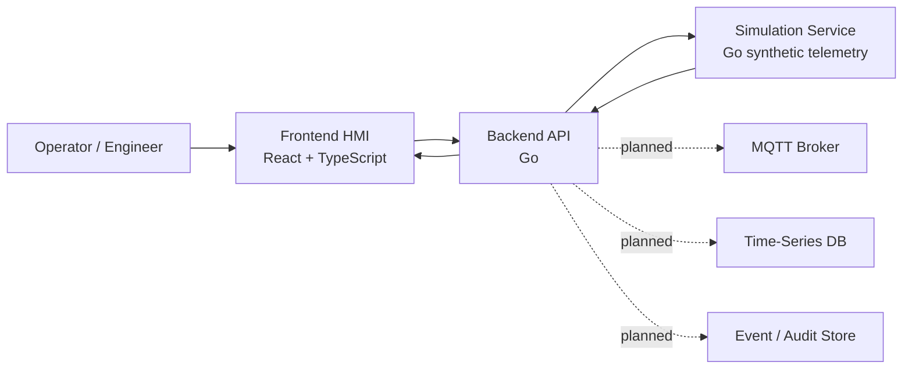

# SMR Twin Platform

Simulation-only digital twin platform for SMR energy systems. No real plant control.

SMR Twin Platform is a modular digital twin simulator for portfolio and educational industrial software work. The project demonstrates HMI-style frontend engineering, Go backend architecture, synthetic simulation, telemetry contracts, alarms, scenarios, in-memory history, Docker-based local development, and safety-conscious system boundaries.

The current MVP has two explicit domain levels:

- **SMR Unit Overview**: high-level synthetic unit metrics such as power, primary temperature, coolant flow, turbine speed, and generator load.
- **Thermal Process Loop MVP**: lower-level training loop used as the base for future valve, pump, PID, command, telemetry, and alarm work.

```text
Tank -> Pump -> Control Valve -> Heat Exchanger -> Sensors -> PID Controller -> HMI
```

> This project is a simulation and educational engineering platform. It is not a nuclear plant control system and must not be used for safety-critical automation, real facility integration, or real reactor operation.

## Implemented Now

- Monorepo structure for `apps`, `services`, `packages`, `infra`, `docs`, and `scripts`.
- React + TypeScript frontend shell with Dashboard, Process, Alarms, Events, Trends, and Settings pages.
- Go API service with health, system status, assets, latest telemetry, history, alarm lifecycle, event, command, and scenario proxy endpoints.
- Go simulation service with deterministic synthetic telemetry, scenarios, active alarm generation, and in-memory history.
- Docker Compose stack for `web`, `api`, and `simulation`.
- Polling-based live telemetry from frontend to API.
- Dashboard overview backed by live API status, synthetic telemetry, active alarms, alarm history, command history, and recent events.
- API proxy from backend to simulation service, with clearly labelled in-memory fallback data for selected endpoints.
- Basic synthetic scenarios such as normal, startup, load ramp, high temperature, pressure deviation, pump degradation, sensor drift, and trip.
- Alarm lifecycle for synthetic alarm instances: `ACTIVE`, `ACKNOWLEDGED`, and `CLEARED`.
- Alarm history for cleared in-memory alarm instances.
- Unified recent event stream for command, alarm, equipment, and simulation events.
- In-memory telemetry history for trend charts.
- Process asset cards backed by the API assets endpoint, with labelled fallback states.
- Trends summary cards backed by latest API telemetry and chart history backed by in-memory simulation history.
- Simulation-only command layer for `V-101` and `P-101` through the API gateway.
- Valve `V-101` and pump `P-101` state machines that update synthetic telemetry.
- In-memory command history and event/audit trail for simulation command attempts.
- Frontend valve and pump control panels with pending, success, and error states.
- Explicit safety boundary in docs and UI copy.

## Partially Implemented

- **Alarms**: active, acknowledged, and cleared alarm workflow exists in memory. Shelving, persistent audit, and production operator workflow are planned.
- **Trends**: in-memory simulation history exists. External TSDB persistence, downsampling APIs, and long-range queries are not implemented yet.
- **Events**: command, alarm, and simulation events are captured in an in-memory recent-event trail and shown on the Events page. Persistent audit storage is planned.
- **Process UI**: process-loop values are bound to live API telemetry when available. Valve and pump controls call simulation-only command endpoints; other process controls remain planned.
- **Scenario controls**: predefined synthetic scenarios can be started/stopped through the API. Declarative YAML/JSON scenario definitions are planned.
- **Assets**: API exposes current simulation assets and fallback process-loop assets. Persistent asset registry is planned.

## Planned Next

- Expanded command arbitration for user, scenario, PID, and system sources.
- Persistent command history and audit storage.
- Alarm shelving and richer operator workflow.
- Persistent event/audit storage.
- MQTT bridge for simulated telemetry.
- PID control module and manual/auto arbitration.
- Persistent historian with PostgreSQL/TimescaleDB or another time-series store.
- WebSocket or SSE real-time transport.
- Report export.
- Auth/RBAC.
- Observability dashboards.

## Not Implemented Yet

- MQTT broker or MQTT ingestion.
- Kafka, Redpanda, or NATS.
- PostgreSQL, TimescaleDB, InfluxDB, Redis, or MinIO persistence.
- PID controller.
- Production auth/RBAC.
- PDF/Excel report export.
- Kubernetes or Helm deployment.
- Real nuclear plant interface.
- Safety-critical automation.

## Current Architecture



The frontend calls only `apps/api`. The simulation service remains an internal backend dependency so the API layer can later add auth, audit, rate limiting, observability, persistence, and transport changes without forcing frontend contract churn.

## Domain Levels

### SMR Unit Overview

High-level synthetic unit telemetry for dashboard and trend validation:

- `SMR-POWER`
- `THERMAL-MW`
- `ELECTRIC-MW`
- `TT-PRIMARY`
- `PT-PRIMARY`
- `FT-COOLANT`
- `TURBINE-RPM`
- `GEN-LOAD`

### Thermal Process Loop MVP

Lower-level process-loop tags used by the HMI mnemonic and future command layer:

- `T-101` tank
- `P-101` pump
- `V-101` control valve
- `HX-101` heat exchanger
- `TT-101` loop temperature
- `PT-101` loop pressure
- `FT-101` loop flow
- `LT-101` tank level
- `TIC-101` PID controller placeholder

See [MVP Domain Model](docs/mvp-domain-model.md) for the current contract and planned extensions.

## Safety Boundary

- Simulation-only platform.
- No real nuclear plant control.
- No safety-critical automation.
- No real reactor operating procedures.
- No connection to real plant networks or physical actuators.
- Simulation commands apply only to in-memory simulated assets.
- Command history and event/audit records are in-memory only at this stage.
- Alarm acknowledge/clear actions apply only to synthetic in-memory alarm instances.
- UI and API copy must preserve the distinction between monitoring, simulation, advisory concepts, and real control.

## Technology Stack

| Area | Current / planned stack |
| --- | --- |
| Frontend / HMI | React, TypeScript, Vite, Tailwind CSS, shadcn-style UI primitives, Recharts |
| Backend | Go, REST, structured logging, simulation gateway |
| Simulation | Go synthetic telemetry engine |
| Messaging | MQTT planned, not implemented |
| Data | In-memory now; PostgreSQL/TimescaleDB planned |
| DevOps | Docker, Docker Compose, Makefile |
| Security | Safety boundary and in-memory command audit now; auth/RBAC and persistent audit planned |

## Repository Layout

```text
apps/
  web/          React HMI and engineering UI
  api/          Go backend core
  simulation/   Go simulation-only telemetry engine
services/
  telemetry/    future telemetry ingestion service
  historian/    future time-series query service
  alarm/        future alarm engine service
packages/
  proto/        shared protocol definitions
  schemas/      shared DTO and event schemas
  ui/           shared UI primitives
infra/
  docker/       Docker-related local infrastructure
  k8s/          future Kubernetes manifests
docs/           architecture, product vision, domain model, safety notes
scripts/        automation and helper scripts
```

## How To Run

Start the current local stack:

```bash
make dev
```

Equivalent explicit command:

```bash
make dev-up
```

Stop the local stack:

```bash
make down
```

Run checks:

```bash
make test
make lint
```

Run individual services locally:

```bash
make api-run
make simulation-run
make web-build
```

## Available Services

| Service | URL |
| --- | --- |
| Web HMI | http://localhost:5173 |
| API | http://localhost:8080 |
| Simulation service | http://localhost:8081 |

Current Docker Compose services:

- `web`
- `api`
- `simulation`

No database, MQTT broker, Redis, Grafana, or object storage service is included in this milestone.

## Available API Endpoints

API gateway:

```bash
curl http://localhost:8080/health
curl http://localhost:8080/api/v1/system/status
curl http://localhost:8080/api/v1/assets
curl http://localhost:8080/api/v1/telemetry/latest
curl "http://localhost:8080/api/v1/telemetry/history?window=15m"
curl http://localhost:8080/api/v1/alarms/active
curl http://localhost:8080/api/v1/alarms/history
curl -X POST http://localhost:8080/api/v1/alarms/alarm-id/acknowledge \
  -H "Content-Type: application/json" \
  -d '{"acknowledgedBy":"demo-operator","comment":"Acknowledged from API"}'
curl -X POST http://localhost:8080/api/v1/commands \
  -H "Content-Type: application/json" \
  -d '{"targetTag":"V-101","commandType":"SET_POSITION","payload":{"positionPercent":75}}'
curl http://localhost:8080/api/v1/commands/recent
curl http://localhost:8080/api/v1/events/recent
curl http://localhost:8080/api/v1/simulation/scenarios
curl -X POST http://localhost:8080/api/v1/simulation/scenarios/high_temperature/start
curl -X POST http://localhost:8080/api/v1/simulation/scenarios/stop
curl -X POST http://localhost:8080/api/v1/simulation/reset
```

Simulation service, usually called through the API:

```bash
curl http://localhost:8081/health
curl http://localhost:8081/api/v1/simulation/status
curl http://localhost:8081/api/v1/simulation/telemetry/latest
curl http://localhost:8081/api/v1/simulation/alarms/active
curl http://localhost:8081/api/v1/simulation/alarms/history
curl -X POST http://localhost:8081/api/v1/simulation/alarms/alarm-id/acknowledge \
  -H "Content-Type: application/json" \
  -d '{"acknowledgedBy":"demo-operator","comment":"Acknowledged from simulation API"}'
curl -X POST http://localhost:8081/api/v1/simulation/commands \
  -H "Content-Type: application/json" \
  -d '{"targetTag":"P-101","commandType":"START","source":"frontend","requestedBy":"demo-engineer"}'
curl http://localhost:8081/api/v1/simulation/commands/recent
curl http://localhost:8081/api/v1/simulation/events/recent
```

## Known Limitations

- Live UI transport is polling, not WebSocket/SSE.
- Telemetry history is in-memory and resets with the simulation service.
- Command history and event/audit records are in-memory and reset with the simulation service.
- Alarm lifecycle and history are in-memory and reset with the simulation service.
- Command support is limited to simulated `V-101` valve and `P-101` pump assets.
- Events are recent in-memory command/alarm/simulation records, not a persistent event log service.
- Data source switching in UI is not a real runtime integration switch yet.
- Frontend bundle currently builds as a single large SPA chunk.
- Dashboard data is live for the local simulator, but it still uses REST polling and in-memory simulation sources.
- The simulation is synthetic and intentionally not a real reactor physics model.

## Roadmap

1. Stabilize architecture truth, domain levels, live process UI, and dev commands.
2. Add simulation-only command layer for valve and pump with event/audit trail.
3. Add dashboard/event stream polish, schema generation, and Playwright smoke coverage.
4. Add MQTT bridge for simulated telemetry.
5. Add PID/manual-auto control in simulation-only mode.
6. Add persistent historian and trend APIs.
7. Add report export.
8. Add auth/RBAC, observability, CI, and deployment hardening.

## Documentation

- [Project Vision](docs/project-vision.md)
- [MVP Domain Model](docs/mvp-domain-model.md)
- [Architecture Notes](docs/architecture.md)
- [Safety Boundary](docs/safety-boundary.md)
