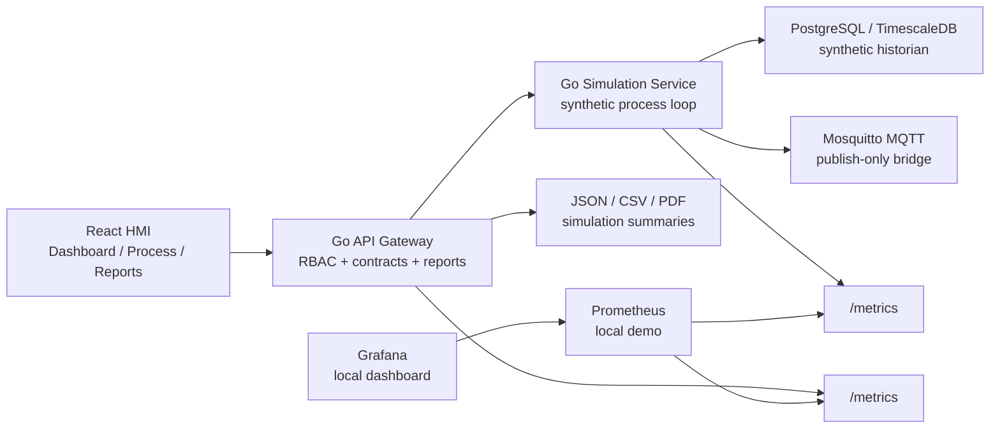
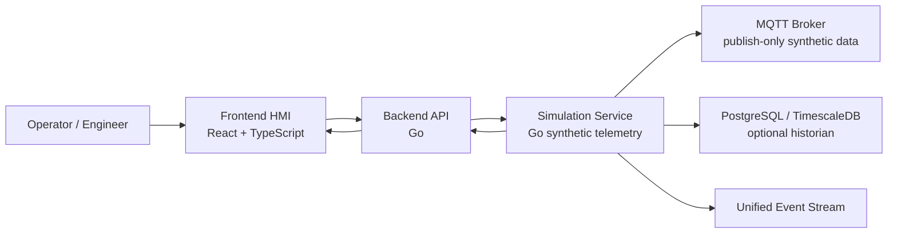

# SMR Digital Twin Platform


Simulation-only industrial digital twin / IIoT demo platform for synthetic SMR-style thermal process monitoring, control workflow, historian persistence, MQTT publishing, JSON/CSV/PDF reporting, and local observability. No real plant control.

SMR Digital Twin Platform is a portfolio-grade engineering project, not a nuclear operations product. It demonstrates a full-stack industrial software architecture: React HMI, Go API gateway, Go simulation service, PostgreSQL/TimescaleDB historian, publish-only MQTT bridge, demo Auth/RBAC, OpenAPI/JSON Schema contracts, report export, Prometheus/Grafana local observability, and a broad CI test suite.

The current MVP has two explicit domain levels:

- **SMR Unit Overview**: high-level synthetic unit metrics such as power, primary temperature, coolant flow, turbine speed, and generator load.
- **Thermal Process Loop MVP**: lower-level training loop used as the base for future valve, pump, PID, command, telemetry, and alarm work.

```text
Tank -> Pump -> Control Valve -> Heat Exchanger -> Sensors -> PID Controller -> HMI
```

> This project is a simulation and educational engineering platform. It is not a nuclear plant control system and must not be used for safety-critical automation, real facility integration, or real reactor operation.

## What This Project Demonstrates

| Area               | Demonstrated implementation                                                                                             | Why it matters                                                             |
| ------------------ | ----------------------------------------------------------------------------------------------------------------------- | -------------------------------------------------------------------------- |
| Industrial HMI     | Dashboard, Process, Alarms, Events, Trends, Reports, Settings                                                           | Shows operator-style workflows rather than a generic CRUD app.             |
| API gateway        | Go REST gateway, structured errors, demo RBAC enforcement, report aggregation                                           | Keeps the frontend contract stable and protects write/action endpoints.    |
| Simulation engine  | Synthetic process loop, scenarios, `V-101`/`P-101` state machines, `TIC-101` PID                                        | Provides realistic demo dynamics without real plant connectivity.          |
| Command workflow   | Manual/auto/disabled arbitration, command status, event records                                                         | Demonstrates control authority boundaries in a simulation-only setting.    |
| Historian          | Optional PostgreSQL/TimescaleDB persistence, 30-day raw retention metadata, and 1-minute synthetic telemetry aggregates | Demonstrates time-series storage, downsampling, and fallback behavior.     |
| MQTT               | Publish-only synthetic telemetry/events/alarms/status bridge                                                            | Shows IIoT integration while explicitly avoiding MQTT command ingestion.   |
| Reports            | JSON/CSV/PDF simulation summary export                                                                                  | Useful portfolio/demo artifact, clearly not regulatory reporting.          |
| Scenario authoring | UI workspace for simulation-only YAML scenario drafts, preview, validation, copy, and download                          | Helps explain declarative scenarios without runtime deployment semantics.  |
| Observability      | API/simulation `/metrics`, Prometheus, Grafana dashboard provisioning                                                   | Gives local diagnostics for platform health and synthetic process metrics. |
| Quality gates      | Go test/vet/race/coverage, Vitest, Playwright E2E/a11y/visual, smokes, scans                                            | Shows production-style engineering discipline without production claims.   |

## 5-Minute Demo Story

1. Open the Dashboard and point out the simulation-only boundary, historian status, MQTT status, active alarms, recent events, and synthetic telemetry.
2. Go to Process as the demo operator and send a `V-101` valve position command or `P-101` pump command.
3. Switch to a supervisor or admin role and change `TIC-101` to `AUTO`; show that the simulation-only PID owns the valve output.
4. Trigger a synthetic scenario, then open Alarms and Events to show alarm activation, acknowledgement, clearing, and the unified event trail.
5. Open Trends to show live, raw historian, or 1-minute aggregated historian source labels.
6. Open Reports and export a JSON, CSV, or PDF simulation summary. Emphasize that it is not a regulatory or production audit report.
7. Open Scenario Authoring, choose a template, validate the YAML draft, and download it. Explain that it is draft/export only and does not deploy to real equipment.
8. Start the optional observability profile and show Prometheus/Grafana local metrics for API and simulation health.
9. Mention that MQTT publishes synthetic data only and has no command ingestion topics.
10. Close with the CI page: API, simulation, web, E2E, a11y, visual regression, Docker smokes, race/coverage, and dependency scans.

## Architecture Overview



The frontend talks only to `apps/api`. The API gateway enforces demo RBAC for protected actions, proxies read/write requests to the simulation service, and aggregates read-only reports. The simulation service owns synthetic process state, historian writes, MQTT publishing, scenarios, alarms, commands, PID/control state, and simulation metrics.

## Demo Screenshots

Final portfolio screenshots live under `docs/assets/screenshots/` and are captured from the simulation-only HMI. They are visual demo assets, not evidence of real plant operation or certified HMI behavior.

| View               | Screenshot                                                                |
| ------------------ | ------------------------------------------------------------------------- |
| Dashboard          | [Dashboard](docs/assets/screenshots/dashboard-dark.png)                   |
| Process            | [Process](docs/assets/screenshots/process-dark.png)                       |
| Trends             | [Trends](docs/assets/screenshots/trends-dark.png)                         |
| Reports            | [Reports](docs/assets/screenshots/reports-dark.png)                       |
| Scenario Authoring | [Scenario Authoring](docs/assets/screenshots/scenario-authoring-dark.png) |
| Settings           | [Settings](docs/assets/screenshots/settings-dark.png)                     |

To refresh them from a running local app:

```bash
make demo-assets-update
```

## Demo-Only, Not Production

| Capability       | Demo status                                                                                                        | Not production because                                                                    |
| ---------------- | ------------------------------------------------------------------------------------------------------------------ | ----------------------------------------------------------------------------------------- |
| Process commands | Mutate `V-101`/`P-101` simulation state only                                                                       | No PLC, DCS, SCADA, actuator, or plant network connectivity.                              |
| Demo RBAC        | Static users via `X-Demo-User` and frontend role switcher                                                          | No passwords, OAuth/JWT, persistent users, or production identity controls.               |
| Historian        | Stores synthetic telemetry/events/commands/alarms, with demo raw retention metadata and 1-minute aggregate history | No immutable audit policy, regulatory retention, or compliance guarantees.                |
| MQTT             | Publishes synthetic data only                                                                                      | No MQTT command ingestion, broker ACL/TLS hardening, or real equipment topics.            |
| Reports          | JSON/CSV/PDF synthetic simulation summaries                                                                        | Not regulatory reporting, not a production audit export, not nuclear compliance evidence. |
| Observability    | Local Prometheus/Grafana demo profile                                                                              | No production alerting, log aggregation, tracing, SLOs, or secure operations setup.       |

## Quickstart

Full local stack:

```bash
docker compose up --build
```

Open:

- HMI: `http://localhost:5173`
- API: `http://localhost:8080`
- Simulation: `http://localhost:8081` bound to localhost for local diagnostics; the frontend should call the API gateway, not the simulation service directly.
- MQTT broker: `tcp://localhost:1883`

Optional local observability:

```bash
docker compose --profile observability up --build
```

- Prometheus: `http://localhost:9090`
- Grafana: `http://localhost:3000` with local demo credentials `admin` / `admin`

Local service development:

```bash
cd apps/simulation && go run ./cmd/simulation
cd apps/api && go run ./cmd/api
cd apps/web && npm ci && npm run dev
```

## Repository Quality Workflow

Install the lightweight local Git hooks once:

```bash
make hooks-install
```

Fast pre-commit checks:

```bash
make precommit
```

Heavier pre-push checks:

```bash
make prepush
```

Repository hygiene checks:

```bash
make repo-check
```

These commands run the generated artifact guard, Go formatting checks, frontend Prettier checks, Go module tidy checks, contract checks, and Docker Compose validation. The hooks are advisory local guardrails for this simulation-only demo repository; GitHub Actions remains the source of truth before merge.

## Implemented Now

- Monorepo structure for `apps`, `services`, `packages`, `infra`, `docs`, and `scripts`.
- React + TypeScript frontend shell with Dashboard, Process, Alarms, Events, Trends, Reports, and Settings pages.
- Go API service with health, system status, assets, latest telemetry, history, alarm lifecycle, event, command, and scenario proxy endpoints.
- Go simulation service with deterministic synthetic telemetry, scenarios, active alarm generation, in-memory fallback history, and optional PostgreSQL/TimescaleDB historian writes.
- Docker Compose stack for `web`, `api`, `simulation`, local TimescaleDB/PostgreSQL, local Eclipse Mosquitto broker, and optional local Prometheus/Grafana observability.
- Polling-based live telemetry from frontend to API.
- Dashboard overview backed by live API status, synthetic telemetry, active alarms, alarm history, command history, and recent events.
- API proxy from backend to simulation service, with clearly labelled in-memory fallback data for selected endpoints.
- Basic synthetic scenarios such as normal, startup, load ramp, high temperature, pressure deviation, pump degradation, sensor drift, and trip.
- Alarm lifecycle for synthetic alarm instances: `ACTIVE`, `ACKNOWLEDGED`, and `CLEARED`.
- Alarm history for synthetic alarm instances, persisted when the historian is enabled.
- Unified recent event stream for command, alarm, equipment, and simulation events.
- In-memory telemetry history for trend charts.
- Process asset cards backed by the API assets endpoint, with labelled fallback states.
- Trends summary cards backed by latest API telemetry and chart history backed by raw or 1-minute aggregated persistent historian data when available, with in-memory fallback.
- Simulation-only command layer for `V-101` and `P-101` through the API gateway.
- Simulation-only `TIC-101` control modes for command arbitration: `MANUAL`, `AUTO`, and `DISABLED`.
- Command arbitration for direct `V-101` commands, with `AUTO` assigning authority to the simulation-only `TIC-101` PID controller.
- Simulation-only `TIC-101` PID controller for the synthetic `TT-101 -> V-101.POS` thermal loop.
- Valve `V-101` and pump `P-101` state machines that update synthetic telemetry.
- Command history and event/audit trail for simulation command attempts, persisted when the historian is connected and kept in memory as fallback.
- Persistent historian status endpoint and minimal Dashboard/Trends/Settings historian source labels.
- Publish-only MQTT bridge for synthetic telemetry snapshots, events, alarms, command status, PID status, control mode, historian status, and system status.
- MQTT bridge status endpoint and minimal Dashboard/Settings status labels.
- Demo Auth/RBAC layer with static simulation-only users, a role switcher, `X-Demo-User` header, and backend enforcement for protected write/action endpoints.
- Simulation-only JSON/CSV/PDF report export through the API gateway and Reports page. These reports are not regulatory, compliance, or production audit reports.
- Scenario Authoring workspace for simulation-only YAML drafts with template selection, local validation, preview, copy, and download. It does not persist, deploy, execute, or mutate runtime scenarios.
- Local demo observability baseline with API/simulation `/metrics`, Prometheus scraping, and Grafana dashboard provisioning.
- Frontend valve and pump control panels with pending, success, and error states.
- GitHub Actions CI quality gates for Go API, Go simulation, frontend, Docker Compose config validation, visual regression, smoke tests, race/coverage checks, and dependency/security scans.
- Expanded Playwright Chromium E2E suite plus a lightweight Chromium/Firefox smoke matrix for Dashboard, Process, Reports, Settings, MQTT status, and historian status. WebKit is deferred until the CI smoke is stable.
- Playwright visual regression baseline for Dashboard, Process, Alarms, Events, Trends, Reports, and Settings across deterministic themes and responsive widths.
- Local log artifact folder and smoke diagnostic reports under `logs/`.
- OpenAPI 3.1 contract and JSON Schema reference files under `packages/schemas`, with CI checks for OpenAPI parsing, JSON Schema compilation, generated TypeScript drift, and runtime validation coverage.
- Generated frontend API schema types committed under `apps/web/src/shared/api/generated`.
- TanStack Query frontend data layer with typed REST hooks, query keys, polling intervals, and mutation invalidation.
- Runtime API validation in the frontend HTTP client for dev/test contract drift detection, including control mode payloads.
- Vitest + React Testing Library component tests for key HMI/status/control UI surfaces.
- Explicit safety boundary in docs and UI copy.

## Partially Implemented

- **Alarms**: active, acknowledged, and cleared alarm workflow exists in memory. Shelving, persistent audit, and production operator workflow are planned.
- **Trends**: PostgreSQL/TimescaleDB-backed raw telemetry history and 1-minute aggregate history exist when the historian is enabled. In-memory history remains the fallback, and the current UI exposes Auto, Raw, and 1-minute resolution controls with source/sample/retention labels.
- **Events**: command, alarm, control, PID, scenario, and simulation events are captured in memory and persisted when the historian is connected. This is still not a production audit archive.
- **Process UI**: process-loop values are bound to live API telemetry when available. Valve and pump controls call simulation-only command endpoints; `TIC-101` mode controls whether direct valve commands are allowed.
- **Scenario controls**: predefined synthetic scenarios are loaded from validated YAML configuration and can be started/stopped through the API.
- **Assets**: API exposes current simulation assets and fallback process-loop assets. Persistent asset registry is planned.
- **API contract layer**: OpenAPI, JSON Schema references, generated TypeScript types, runtime validation mappings, and CI drift checks exist for core DTOs. Go server code generation is not implemented yet.
- **Report export**: JSON, CSV, and PDF simulation summaries are implemented for demo use. Excel export and regulatory reporting are not implemented.
- **Observability**: local Prometheus/Grafana demo stack and service metrics are implemented. Production logging/tracing/alerting is not implemented.

## Planned Next

- Alarm shelving and richer operator workflow.
- MQTT command ingestion and broker production hardening.
- WebSocket or SSE real-time transport.
- Production authentication and production RBAC.
- Production observability hardening and tracing.

## Not Implemented Yet

- MQTT command ingestion or MQTT-based control.
- Production MQTT broker auth/ACL/TLS.
- Kafka, Redpanda, or NATS.
- InfluxDB, Redis, or MinIO persistence.
- Production auth/RBAC.
- Excel report export.
- Regulatory/compliance report export.
- Kubernetes or Helm deployment.
- Real nuclear plant interface.
- Safety-critical automation.

## Current Architecture



The frontend calls only `apps/api`. The simulation service remains an internal backend dependency so the API layer can later add auth, audit, rate limiting, observability, persistence, and transport changes without forcing frontend contract churn.

## Domain Levels

### SMR Unit Overview

High-level synthetic unit telemetry for dashboard and trend validation:

- `SMR-POWER`
- `THERMAL-MW`
- `ELECTRIC-MW`
- `TT-PRIMARY`
- `PT-PRIMARY`
- `FT-COOLANT`
- `TURBINE-RPM`
- `GEN-LOAD`

### Thermal Process Loop MVP

Lower-level process-loop tags used by the HMI mnemonic and future command layer:

- `T-101` tank
- `P-101` pump
- `V-101` control valve
- `HX-101` heat exchanger
- `TT-101` loop temperature
- `PT-101` loop pressure
- `FT-101` loop flow
- `LT-101` tank level
- `TIC-101` manual/auto/disabled arbitration status and simulation-only PID output telemetry

See [MVP Domain Model](docs/mvp-domain-model.md) for the current contract and planned extensions.

## Safety Boundary

- Simulation-only platform.
- No real nuclear plant control.
- No safety-critical automation.
- No real reactor operating procedures.
- No connection to real plant networks or physical actuators.
- Simulation commands apply only to in-memory simulated assets.
- Manual/auto/disabled mode changes apply only to in-memory `TIC-101` simulation state.
- `AUTO` mode lets the simulation-only `TIC-101` PID controller apply an in-memory `V-101.POS` target.
- MQTT publishes synthetic simulation data only and does not accept commands or control equipment.
- Demo RBAC restricts synthetic simulation actions inside the portfolio platform. It does not provide production-grade identity or access control.
- Command history, event records, alarm lifecycle, and telemetry history store only synthetic simulation data. When PostgreSQL/TimescaleDB is enabled, the persistent historian is for demo, learning, and portfolio use only.
- Alarm acknowledge/clear actions apply only to synthetic in-memory alarm instances.
- UI and API copy must preserve the distinction between monitoring, simulation, advisory concepts, and real control.

## Technology Stack

| Area           | Current / planned stack                                                                                          |
| -------------- | ---------------------------------------------------------------------------------------------------------------- |
| Frontend / HMI | React, TypeScript, Vite, Tailwind CSS, shadcn-style UI primitives, Recharts, TanStack Query                      |
| Backend        | Go, REST, structured logging, simulation gateway                                                                 |
| Simulation     | Go synthetic telemetry engine                                                                                    |
| Messaging      | Eclipse Mosquitto local demo broker plus publish-only MQTT bridge for synthetic data                             |
| Data           | In-memory fallback plus optional PostgreSQL/TimescaleDB historian for synthetic telemetry/events/commands/alarms |
| DevOps         | Docker, Docker Compose, Makefile                                                                                 |
| Security       | Safety boundary, demo-only RBAC for simulation actions, and in-memory/persistent demo command trail              |

## Repository Layout

```text
apps/
  web/          React HMI and engineering UI
  api/          Go backend core
  simulation/   Go simulation-only telemetry engine
services/
  telemetry/    future telemetry ingestion service
  historian/    optional PostgreSQL/TimescaleDB write/read layer inside simulation service
  alarm/        future alarm engine service
packages/
  proto/        shared protocol definitions
  schemas/      shared DTO and event schemas
  ui/           shared UI primitives
infra/
  docker/       Docker-related local infrastructure
  k8s/          future Kubernetes manifests
docs/           architecture, product vision, domain model, safety notes
scripts/        automation and helper scripts
```

## How To Run

Start the current local stack:

```bash
make dev
```

Equivalent explicit command:

```bash
make dev-up
```

Stop the local stack:

```bash
make down
```

Run checks:

```bash
make test
make lint
```

Run individual services locally:

```bash
make api-run
make simulation-run
make web-build
```

## CI Quality Gates

The repository includes a GitHub Actions workflow at `.github/workflows/ci.yml`.
It runs on `push` and `pull_request` and checks the current simulation-only MVP without deploying or starting the full stack.

Automated CI jobs:

- **API**: `go test ./...` and `go vet ./...` in `apps/api`.
- **Simulation**: `go test ./...` and `go vet ./...` in `apps/simulation`.
- **Race/Coverage**: `go test -race ./...` and `go test -cover ./...` for API and simulation.
- **Web**: `npm ci`, `npm run typecheck`, `npm run lint`, `npm run test`, and `npm run build` in `apps/web`.
- **API types**: `npm run api:types` regenerates frontend contract types before frontend checks.
- **API schemas/contracts**: `npm run api:validate-openapi`, `npm run api:validate-schemas`, and `npm run api:validate-contract-coverage` validate the OpenAPI document, JSON Schema files, and frontend runtime validation coverage.
- **Frontend component tests**: `npm run test` runs Vitest/React Testing Library rendering and interaction checks.
- **Compose**: `docker compose config --quiet` from the repository root.
- **E2E Browser**: starts the Go simulation and API services, launches the Vite frontend through Playwright, and runs the expanded Chromium browser regression suite.
- **Visual Regression**: starts the Go simulation and API services, launches the Vite frontend through Playwright, and compares committed screenshot baselines for core HMI pages.
- **Security / Dependencies**: runs `govulncheck` for Go services and `npm audit --audit-level=high` for the frontend dependency tree.
- **Historian DB Smoke**: verifies Docker Compose raw and 1-minute aggregate persistence through PostgreSQL/TimescaleDB.
- **MQTT Bridge Smoke**: verifies the Docker Compose MQTT broker receives publish-only synthetic telemetry and command/event status messages.
- **Load and Soak Baseline**: runs a short CI synthetic workload across commands, scenarios, historian raw/aggregate reads, report export, MQTT publishing, Prometheus, Grafana, API latency, error rate, memory, and goroutine growth.

## Frontend Data Layer

The frontend API layer uses the generated OpenAPI TypeScript types with a small typed REST client and TanStack Query hooks.

Current behavior:

- `VITE_API_BASE_URL` configures the API gateway URL, with `http://localhost:8080` as the local fallback.
- Live simulation data still uses REST polling, not WebSocket or SSE.
- Query keys are centralized in `apps/web/src/shared/api/query-keys.ts`.
- Mutations for simulation-only commands, alarm acknowledgement, and scenarios invalidate related telemetry, alarm, event, command, and scenario queries.
- Runtime API validation can run in `warn` or `strict` mode for selected request/response payloads.

Local equivalents:

```bash
cd apps/api
go test ./...
go vet ./...

cd ../simulation
go test ./...
go vet ./...

cd ../web
npm run api:types
npm run typecheck
npm run lint
npm run build

cd ../..
docker compose config --quiet
```

## E2E Browser Tests

Playwright browser tests live in `apps/web/tests/e2e`.

The expanded suite verifies synthetic simulation workflows only:

- Dashboard live status, historian status, MQTT status, and simulation-only boundary copy.
- Process manual `V-101` and `P-101` command flows.
- Manual to AUTO mode, PID active state, and valve command arbitration.
- Alarm activate, acknowledge, clear, and related events.
- Events filtering and sorting.
- Trends chart/source labels with live or fallback data.
- Settings capability/status copy for MQTT, historian, PID/manual-auto, and safety boundary.
- Basic degraded integration state rendering via Playwright route mocks.
- Accessibility baseline checks with axe for serious/critical violations across core pages.
- Keyboard navigation for skip link, sticky sidebar navigation, and PID/valve inputs.
- Demo RBAC role flows for read-only viewer behavior, operator commands, engineer PID tuning, supervisor alarm acknowledgement, and backend 403 enforcement.

Local commands:

```bash
cd apps/web
npm run test:e2e:install
npm run test:e2e
npm run test:a11y
npm run test:e2e:headed
npm run test:e2e:ui
```

For local runs, API and simulation should be reachable at `http://127.0.0.1:8080` and `http://127.0.0.1:8081`; the Playwright config starts only the Vite frontend dev server. CI starts the Go backend services before running the browser suite. Full PostgreSQL/TimescaleDB and MQTT broker behavior is covered by the separate historian and MQTT smoke scripts.

The desktop layout keeps the primary sidebar sticky and keyboard-reachable while the page scrolls. On narrower screens the sidebar falls back to the responsive static layout so it does not cover HMI content. The skip link moves keyboard users directly to the main simulation-only workspace.

## Visual Regression Tests

Playwright visual tests live in `apps/web/tests/visual`. They compare fixed-viewport screenshot baselines for the simulation-only HMI pages and are meant to catch accidental layout regressions such as overlapping status cards, missing badges, broken responsive behavior, and sticky sidebar issues.

Covered baseline states include:

- Dashboard, Process, Alarms, Events, Trends, Reports, and Settings in desktop dark theme.
- Dashboard, Process, Reports, and Settings in desktop light theme.
- Dashboard, Process, and Settings across tablet/mobile dark layouts.

Local commands:

```bash
cd apps/web
npm run test:visual
npm run test:visual:update
```

Visual tests set a deterministic demo user, theme, viewport, reduced motion preference, and disabled animation styles. Dynamic synthetic values, recent rows, and chart regions are masked where needed. A small screenshot tolerance is used for CI/desktop rasterization differences, with one slightly higher tablet Dashboard tolerance for cross-platform font wrapping. Baseline screenshots are committed intentionally; generated reports under `playwright-report/` and `test-results/` are ignored by Git.

## Frontend Component Tests

Fast component tests live beside frontend source files and use Vitest, React Testing Library, jest-dom, jsdom, and user-event. They verify UI rendering and interactions without real network calls.

```bash
cd apps/web
npm run test
npm run test:watch
```

Component tests cover status rendering, MQTT/historian labels, control mode and PID panels, valve/pump controls, alarm rows, Events filters, Trends source labels, and Settings capability copy. They complement, but do not replace, Playwright browser workflows and Docker smoke scripts.

## Demo Auth / RBAC

The demo RBAC layer restricts simulation-only actions for portfolio and learning workflows. It is not production authentication, has no passwords, has no OAuth/JWT login, and does not represent real plant access control.

The frontend stores the selected demo user in localStorage and sends it to the API gateway as `X-Demo-User`. If the header is missing or unknown, the API falls back to `demo-operator` so existing local demo flows remain usable. Protected write/action endpoints are enforced in the API gateway and return `403 RBAC_FORBIDDEN` when the selected demo role lacks permission.

| Role       | Can view | Commands | PID tuning | Control mode | Alarm acknowledge | Scenario actions |
| ---------- | -------- | -------- | ---------- | ------------ | ----------------- | ---------------- |
| VIEWER     | Yes      | No       | No         | No           | No                | No               |
| ENGINEER   | Yes      | No       | Yes        | No           | No                | No               |
| OPERATOR   | Yes      | Yes      | No         | No           | No                | No               |
| SUPERVISOR | Yes      | No       | No         | Yes          | Yes               | Yes              |
| ADMIN      | Yes      | Yes      | Yes        | Yes          | Yes               | Yes              |

Useful demo endpoints:

```bash
curl http://localhost:8080/api/v1/auth/session
curl http://localhost:8080/api/v1/auth/users
curl -H "X-Demo-User: demo-viewer" http://localhost:8080/api/v1/auth/session
```

The role switcher in the HMI is explicitly labelled as demo RBAC. It only controls synthetic simulator actions and does not secure real equipment.

## Simulation Report Export

The Reports page and API gateway can export a synthetic simulation summary as JSON, CSV, or PDF:

```bash
curl "http://localhost:8080/api/v1/reports/simulation-summary?window=1h"
curl "http://localhost:8080/api/v1/reports/simulation-summary?window=1h&format=csv"
curl "http://localhost:8080/api/v1/reports/simulation-summary?window=1h&format=pdf"
```

Supported windows are `15m`, `1h`, `6h`, and `24h`. The report includes the current demo user, system/historian/MQTT/control/PID status, latest telemetry, simple telemetry min/max/average summaries, and command/event/alarm counts from existing simulation APIs. PDF output is a simple human-readable simulation summary generated by the API gateway without external rendering services. It is explicitly simulation-only and is not a regulatory report, production audit export, or nuclear compliance artifact.

## Local Observability

API and simulation expose Prometheus text metrics:

```bash
curl http://localhost:8080/metrics
curl http://localhost:8081/metrics
```

Start the optional local Prometheus/Grafana stack:

```bash
docker compose --profile observability up --build
```

Prometheus is available at `http://localhost:9090` and Grafana at `http://localhost:3000`. Grafana is provisioned with a local dashboard and demo credentials `admin` / `admin`; those defaults are for local portfolio/demo use only and are not production secrets or a secure deployment configuration.

Validate the local/demo observability stack with the smoke test:

```bash
node scripts/smoke/observability-smoke.mjs
make observability-smoke
```

The smoke starts Docker Compose with the `observability` profile, checks API and simulation `/metrics`, waits for Prometheus `/-/ready`, verifies Prometheus sees the API and simulation targets as `up`, queries key API/simulation/domain metrics, and checks Grafana `/api/health`. It writes sanitized artifacts under `logs/smoke/<timestamp>_observability-smoke/`. This validates local/demo monitoring of synthetic telemetry only; it is not production monitoring, nuclear safety monitoring, or production alerting.

## Load and Soak Baseline

The load-and-soak baseline proves the simulation-only platform can run under sustained synthetic activity for longer than a short smoke test. It starts the full Docker Compose stack with the observability profile and exercises:

- `V-101` command loop through the API gateway and demo RBAC;
- YAML scenario start loop;
- telemetry latest, raw history, and 1-minute aggregate history reads;
- JSON/CSV/PDF simulation report export;
- historian and MQTT status reads;
- Prometheus target/metric queries and Grafana health;
- API latency/error-rate tracking plus memory and goroutine growth checks.

Run a short local soak:

```bash
make load-soak-short
```

Run the 10-minute default baseline:

```bash
make load-soak
node scripts/smoke/load-and-soak-baseline.mjs --duration-ms 600000
```

Keep the stack running for inspection:

```bash
make load-soak-keep
```

GitHub Actions runs a shorter blocking soak and also provides a manual `Long Load and Soak` workflow for 10-30 minute runs. Artifacts are written under `logs/smoke/<timestamp>_load-and-soak-baseline/`, including latency, error, command, scenario, report, metric, Compose, and debug summaries.

Load-and-soak checks apply only to the synthetic simulation platform. They do not validate real plant control, safety-critical behavior, production monitoring, production load capacity, or regulatory performance.

## Historian DB Smoke Test

The historian DB smoke verifies persistence of synthetic simulation data in the demo TimescaleDB historian through the full Docker Compose stack.

Run from the repository root:

```bash
node scripts/smoke/historian-db-smoke.mjs
```

Or through Make:

```bash
make historian-smoke
make historian-smoke-keep
```

The smoke test:

- starts the isolated Docker Compose project `smr-twin-historian-smoke`;
- waits for API health and connected persistent historian status;
- waits for direct `telemetry_history` rows in PostgreSQL/TimescaleDB, API raw telemetry history records, and API 1-minute aggregate telemetry history records;
- sends a simulation-only `V-101` `SET_POSITION` command;
- verifies command and event records;
- restarts the `simulation` service;
- verifies raw telemetry, aggregated telemetry, command, and event records still exist after restart.

It requires a running Docker daemon. By default it removes the isolated Compose project and volumes after completion. Use `--keep-running` for debugging. On failure, the script writes diagnostics under `historian-smoke-logs/`, including Compose logs, DB counts, the last telemetry history response shape, historian status, and latest telemetry.

The smoke also writes a local report under `logs/smoke/<timestamp>_historian-db-smoke/` on success and failure. The report includes sanitized JSON/text artifacts such as historian status, telemetry history before/after restart, command/event responses, Compose status, and failure diagnostics when applicable.

## Local Log Artifacts

Local diagnostic artifacts are written under `logs/`. Real generated log files are ignored by Git; only `logs/README.md` and `logs/.gitkeep` are committed.

Common commands:

```bash
node scripts/smoke/historian-db-smoke.mjs
make historian-smoke
make logs-clean
node scripts/smoke/mqtt-bridge-smoke.mjs
node scripts/smoke/observability-smoke.mjs
node scripts/smoke/load-and-soak-baseline.mjs --duration-ms 180000
make observability-smoke
make load-soak-short
```

The scripts use Node.js standard library APIs compatible with Node 22+ in CI and the local system Node v24.15.0. Generated logs contain synthetic simulation diagnostics only, can be safely deleted, and are not a production observability stack or certified audit trail.

## MQTT Bridge

The MQTT bridge is a publish-only integration layer for local IIoT/demo workflows. It publishes synthetic simulation payloads to the local Mosquitto broker and cannot control equipment.

Default topic prefix:

```text
smr/site-001/unit-001
```

Example topics:

- `smr/site-001/unit-001/telemetry/snapshot`
- `smr/site-001/unit-001/events`
- `smr/site-001/unit-001/alarms/active`
- `smr/site-001/unit-001/commands/status`
- `smr/site-001/unit-001/control/tic-101/pid/status`
- `smr/site-001/unit-001/control/tic-101/mode`

Smoke test:

```bash
node scripts/smoke/mqtt-bridge-smoke.mjs
make mqtt-smoke
```

Each run writes a sanitized report under `logs/smoke/<timestamp>_mqtt-bridge-smoke/`.

## API Contract / Schemas

The current REST API contract is documented in:

- `packages/schemas/openapi.yaml`
- `packages/schemas/schemas/*.schema.json`

Frontend contract types are generated into:

- `apps/web/src/shared/api/generated/schema.ts`

Regenerate frontend API types from `apps/web`:

```bash
npm run api:types
```

Verify that committed frontend API types are still current:

```bash
npm run api:types:check
npm run api:validate-openapi
npm run api:validate-schemas
npm run api:validate-contract-coverage
```

This contract layer is documentation and frontend type source for the current API gateway. CI fails if generated TypeScript types drift from `packages/schemas/openapi.yaml`, if JSON Schema files fail to compile, or if the explicit runtime validation coverage list loses a core API payload. Frontend dev/test runtime validation is implemented for selected request and response payloads. Generated Go server stubs and Go runtime validation from JSON Schema are not implemented yet.

Contract workflow:

1. Update `packages/schemas/openapi.yaml`.
2. Update the matching `packages/schemas/schemas/*.schema.json` reference schema.
3. Run `cd apps/web && npm run api:types`.
4. Run `npm run api:types:check`, `npm run api:validate-openapi`, `npm run api:validate-schemas`, and `npm run api:validate-contract-coverage`.
5. Keep `apps/web/src/shared/api/validation/schemas.ts` aligned with API payloads that should be checked in dev/test.

## Historian Retention And Downsampling

When the optional TimescaleDB historian is enabled, the simulation service stores synthetic telemetry in `telemetry_history` and writes a 1-minute aggregate table, `telemetry_history_1m`, for trend views. The baseline retention metadata is 30 days for raw synthetic telemetry and 180 days for 1-minute aggregate rows. These policies apply only to demo synthetic data and do not provide production audit immutability or regulatory retention.

Useful examples:

```bash
curl "http://localhost:8080/api/v1/telemetry/history?window=1h"
curl "http://localhost:8080/api/v1/telemetry/history?window=24h&resolution=1m"
curl http://localhost:8080/api/v1/historian/status
```

Supported history windows are `15m`, `1h`, `6h`, and `24h`. Supported resolutions are `raw` and `1m`; requests without a `resolution` parameter keep the previous raw-history behavior.

## Runtime API Validation

The frontend HTTP client validates selected API payloads against JSON Schema during development, tests, and CI.

Modes are controlled by `VITE_API_RUNTIME_VALIDATION`:

- `off`: validation is disabled.
- `warn`: validation errors are written to `console.warn`, and UI flow continues.
- `strict`: validation errors throw `ApiValidationError`, so React Query and Playwright can catch contract drift.

Default behavior:

- local development defaults to `warn`;
- production builds default to `off`;
- the CI Playwright browser regression job runs with `VITE_API_RUNTIME_VALIDATION=strict`.

This is a dev/test contract-hardening layer, not a production security gateway. Backend command and alarm handlers still perform their own request validation for simulation operations.

## Available Services

| Service            | URL                   |
| ------------------ | --------------------- |
| Web HMI            | http://localhost:5173 |
| API                | http://localhost:8080 |
| Simulation service | http://localhost:8081 |
| MQTT broker        | tcp://localhost:1883  |
| Prometheus         | http://localhost:9090 |
| Grafana            | http://localhost:3000 |

Current Docker Compose services:

- `web`
- `api`
- `simulation`
- `postgres`
- `mqtt`
- `prometheus` with the `observability` profile
- `grafana` with the `observability` profile

No Redis, Loki, or object storage service is included in this milestone. The MQTT broker is a local anonymous demo broker only and is not a production security configuration. Grafana uses `admin` / `admin` for local demo use only.

Run the optional local observability stack:

```bash
docker compose --profile observability up --build
```

## Available API Endpoints

API gateway:

```bash
curl http://localhost:8080/health
curl http://localhost:8080/api/v1/system/status
curl http://localhost:8080/api/v1/auth/session
curl http://localhost:8080/api/v1/auth/users
curl http://localhost:8080/metrics
curl http://localhost:8080/api/v1/assets
curl http://localhost:8080/api/v1/telemetry/latest
curl "http://localhost:8080/api/v1/telemetry/history?window=15m"
curl "http://localhost:8080/api/v1/telemetry/history?window=24h&resolution=1m"
curl http://localhost:8080/api/v1/control/status
curl -X POST http://localhost:8080/api/v1/control/mode \
  -H "Content-Type: application/json" \
  -H "X-Demo-User: demo-supervisor" \
  -d '{"mode":"AUTO","requestedBy":"demo-operator","reason":"Enable simulation-only PID demo"}'
curl http://localhost:8080/api/v1/pid/status
curl -X PATCH http://localhost:8080/api/v1/pid/config \
  -H "Content-Type: application/json" \
  -H "X-Demo-User: demo-engineer" \
  -d '{"setpoint":288,"kp":0.9,"ki":0.05,"kd":0.1,"requestedBy":"demo-operator"}'
curl http://localhost:8080/api/v1/historian/status
curl http://localhost:8080/api/v1/mqtt/status
curl http://localhost:8080/api/v1/alarms/active
curl http://localhost:8080/api/v1/alarms/history
curl -X POST http://localhost:8080/api/v1/alarms/alarm-id/acknowledge \
  -H "Content-Type: application/json" \
  -H "X-Demo-User: demo-supervisor" \
  -d '{"acknowledgedBy":"demo-operator","comment":"Acknowledged from API"}'
curl -X POST http://localhost:8080/api/v1/commands \
  -H "Content-Type: application/json" \
  -H "X-Demo-User: demo-operator" \
  -d '{"targetTag":"V-101","commandType":"SET_POSITION","payload":{"positionPercent":75}}'
curl "http://localhost:8080/api/v1/commands/recent?limit=50"
curl "http://localhost:8080/api/v1/events/recent?limit=50"
curl "http://localhost:8080/api/v1/reports/simulation-summary?window=1h"
curl "http://localhost:8080/api/v1/reports/simulation-summary?window=1h&format=csv"
curl "http://localhost:8080/api/v1/reports/simulation-summary?window=1h&format=pdf"
curl http://localhost:8080/api/v1/simulation/scenarios
curl -X POST http://localhost:8080/api/v1/simulation/scenarios/high_temperature/start
curl -X POST http://localhost:8080/api/v1/simulation/scenarios/stop
curl -X POST http://localhost:8080/api/v1/simulation/reset
```

Simulation service, usually called through the API:

```bash
curl http://localhost:8081/health
curl http://localhost:8081/metrics
curl http://localhost:8081/api/v1/simulation/status
curl http://localhost:8081/api/v1/simulation/telemetry/latest
curl http://localhost:8081/api/v1/simulation/control/status
curl -X POST http://localhost:8081/api/v1/simulation/control/mode \
  -H "Content-Type: application/json" \
  -d '{"mode":"MANUAL","requestedBy":"demo-operator"}'
curl http://localhost:8081/api/v1/simulation/pid/status
curl -X PATCH http://localhost:8081/api/v1/simulation/pid/config \
  -H "Content-Type: application/json" \
  -d '{"setpoint":288,"kp":0.9,"ki":0.05,"kd":0.1,"requestedBy":"demo-operator"}'
curl http://localhost:8081/api/v1/simulation/mqtt/status
curl http://localhost:8081/api/v1/simulation/alarms/active
curl http://localhost:8081/api/v1/simulation/alarms/history
curl -X POST http://localhost:8081/api/v1/simulation/alarms/alarm-id/acknowledge \
  -H "Content-Type: application/json" \
  -d '{"acknowledgedBy":"demo-operator","comment":"Acknowledged from simulation API"}'
curl -X POST http://localhost:8081/api/v1/simulation/commands \
  -H "Content-Type: application/json" \
  -d '{"targetTag":"P-101","commandType":"START","source":"frontend","requestedBy":"demo-engineer"}'
curl "http://localhost:8081/api/v1/simulation/commands/recent?limit=50"
curl "http://localhost:8081/api/v1/simulation/events/recent?limit=50"
```

## Known Limitations

- Live UI transport is polling, not WebSocket/SSE.
- Telemetry history can persist to PostgreSQL/TimescaleDB when the historian is enabled, with a 1-minute aggregate path for longer trend windows; otherwise the simulation service uses in-memory fallback history.
- Command history, event records, and alarm history can persist to the local demo historian when connected, but this is not a production compliance archive.
- Alarm active state remains simulation-owned and synthetic; persisted alarm history stores demo lifecycle records only.
- Command support is limited to simulated `V-101` valve and `P-101` pump assets.
- Command arbitration currently applies primarily to the `TIC-101` / `V-101` control loop; `P-101` remains manually controllable.
- `AUTO` mode lets the simulation-only `TIC-101` PID calculate an in-memory `V-101.POS` target.
- Events are simulation records backed by the historian when available, with in-memory fallback if the DB is disabled or unavailable.
- MQTT publishing is one-way and publish-only; MQTT command ingestion, broker auth/ACL, and TLS are not implemented.
- Demo RBAC is header-based and local-demo only; passwords, OAuth/JWT production auth, persistent users, and real plant access control are not implemented.
- Report export is JSON/CSV/PDF for synthetic simulation summaries only; Excel export, production audit immutability, and regulatory reporting are not implemented.
- Observability is a local Prometheus/Grafana demo baseline only; it is not a production logging, tracing, alerting, or SRE stack.
- Data source switching in UI is not a real runtime integration switch yet.
- Frontend uses route-level code splitting; deeper vendor/chart chunk tuning can be added later if needed.
- Dashboard data is live for the local simulator, but it still uses REST polling and synthetic simulation sources.
- Runtime validation is dev/test focused and currently lives in the frontend HTTP client; Go runtime validation from JSON Schema is not implemented yet.
- Go server/client code generation is not implemented yet; Go DTOs are still kept aligned with OpenAPI manually plus CI contract checks.
- The simulation is synthetic and intentionally not a real reactor physics model.

## Roadmap

1. Stabilize architecture truth, domain levels, live process UI, and dev commands.
2. Add simulation-only command layer for valve and pump with event/audit trail.
3. Add OpenAPI schemas, generated frontend types, React Query API layer, runtime validation, and expanded Playwright browser coverage.
4. Harden API contract tooling, simulation domain boundaries, and quality gates.
5. Add persistent historian storage for telemetry, events, commands, and alarm history.
6. Add publish-only MQTT bridge for simulated telemetry and integration smoke coverage.
7. Add optional longer-range aggregate resolutions if they remain clearly simulation-only.
8. Add production-style auth hardening, deployment hardening, and extended CI checks.
9. Add Excel report export only if it remains clearly simulation-only and non-regulatory.

## Documentation

- [Project Vision](docs/project-vision.md)
- [MVP Domain Model](docs/mvp-domain-model.md)
- [Architecture Notes](docs/architecture.md)
- [Safety Boundary](docs/safety-boundary.md)
- [Portfolio Demo Guide](docs/portfolio-demo.md)
