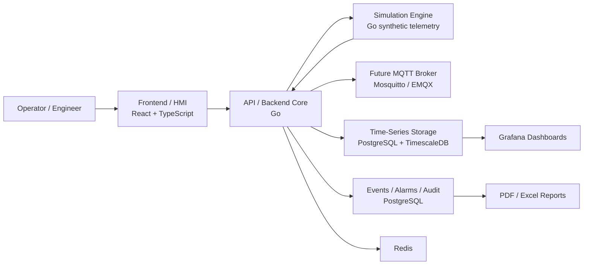

# SMR Twin Platform

Digital Twin for Small Modular Reactor Energy Systems

SMR Twin Platform is a modular, event-driven digital twin simulator for small modular reactor energy systems. The project is focused on safe process simulation, real-time telemetry, industrial HMI visualization, alarm management, scenario execution, historical analysis, and engineering reports.

The first MVP models a simplified process loop:

```text
Tank -> Pump -> Control Valve -> Heat Exchanger -> Sensors -> PID Controller -> HMI
```

> This project is a simulation and educational engineering platform. It is not a nuclear plant control system and must not be used for safety-critical automation or real reactor operation.

## Architecture



The repository starts as a modular monorepo. The backend can be implemented as a modular monolith first, while module boundaries are kept close to future service boundaries.

## MVP Scope

- Industrial HMI shell with dashboard, process, alarms, trends, events, scenarios, and settings areas.
- Static process mnemonic for a simplified thermal-hydraulic loop.
- Live synthetic telemetry from a simulation-only engine with fallback mock state.
- Backend API skeleton with health, status, assets, and latest telemetry endpoints.
- Simulation engine MVP with scenarios, active alarms, and in-memory history.
- Process domain topology endpoint that maps synthetic telemetry and alarms into live mnemonic nodes and edges.
- MQTT-based telemetry path for simulated equipment.
- Valve and pump state-machine simulators.
- Simple process model for flow, pressure, temperature, and level.
- PID controller for automatic process control.
- Alarm panel, event log, historian trends, scenarios, and report export.
- Docker Compose based local environment.

## Out of Scope

- No real nuclear plant control.
- No safety-critical automation.
- No real reactor operation procedures.
- No integration with real plant control networks.
- No advisory output that can be interpreted as operating instructions for a real facility.
- Simulation and educational modelling only.

## Technology Stack

| Area | Planned stack |
| --- | --- |
| Frontend / HMI | React, TypeScript, Vite, Tailwind CSS, shadcn/ui, React Flow, Zustand, TanStack Query, ECharts or Recharts |
| Backend | Go, chi or Gin, REST, WebSocket or SSE, pgx, slog, OpenTelemetry |
| Simulation | Python, FastAPI, NumPy, SciPy, Pydantic, optional Go simulators for equipment state machines |
| Messaging | MQTT with Mosquitto or EMQX, future NATS JetStream or Kafka/Redpanda |
| Data | PostgreSQL, TimescaleDB, Redis, MinIO |
| DevOps | Docker, Docker Compose, GitHub Actions, Prometheus, Grafana, Loki |
| Security | OIDC/JWT, RBAC, audit log, command source separation, IEC 62443-style zoning mindset |

## Repository Layout

```text
apps/
  web/          React HMI and engineering UI
  api/          Go backend core
  simulation/   Go simulation-only telemetry engine
services/
  telemetry/    future telemetry ingestion service
  historian/    future time-series query service
  alarm/        future alarm engine service
packages/
  proto/        shared protocol definitions
  schemas/      shared DTO and event schemas
  ui/           shared UI primitives
infra/
  docker/       Docker-related local infrastructure
  k8s/          future Kubernetes manifests
docs/           architecture, product vision, and engineering notes
scripts/        automation and helper scripts
```

## Roadmap

1. Project vision, monorepo structure, README.
2. Frontend shell with industrial cockpit navigation.
3. Backend skeleton with health and read APIs.
4. Static process diagram and mock telemetry.
5. Simulation engine MVP with live synthetic telemetry, scenarios, alarms, and history.
6. Process domain model and live process mnemonic integration.
7. MQTT broker and telemetry ingestion path.
8. Valve and pump simulators.
9. Real-time UI via WebSocket or SSE.
10. Historian trends, PID control, reports, auth/RBAC, audit log, observability, tests, CI.

## Screenshots

Screenshots will be added as the HMI shell and process mnemonic are implemented.

```text
docs/screenshots/
  dashboard.png
  process-hmi.png
  trends.png
  alarms.png
```

## How To Run

The repository currently contains preparation scaffolding. The commands are intentionally lightweight until the first application services are added.

```bash
make dev
make test
make lint
make down
```

Planned full local startup:

```bash
docker compose up --build
```

Current service commands:

```bash
make api-run
make simulation-run
make web-build
```

Simulation API examples:

```bash
curl http://localhost:8081/api/v1/simulation/telemetry/latest
curl http://localhost:8080/api/v1/process/topology
curl "http://localhost:8080/api/v1/telemetry/history?window=15m"
curl -X POST http://localhost:8080/api/v1/simulation/scenarios/high_temperature/start
```

The Process page now receives live topology from the backend API. The backend aggregates synthetic telemetry, active alarms, simulation status, node definitions, and flow edges into a single `GET /api/v1/process/topology` response.

## Documentation

- [Project Vision](docs/project-vision.md)
- [Architecture Notes](docs/architecture.md)
- [Safety Boundary](docs/safety-boundary.md)
