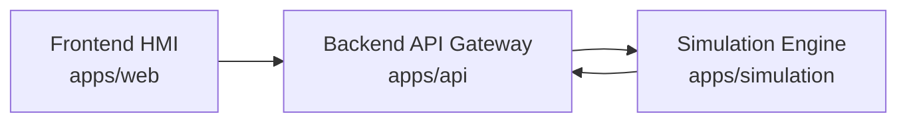

# Architecture Notes

Current MVP runtime path:

The frontend calls only `apps/api`. The simulation service remains an internal backend dependency so the API layer can normalize responses, expose fallback behavior, and later add auth, audit, rate limiting, and observability without changing the frontend contract.

The simulation engine is synthetic and deterministic. It generates telemetry for portfolio/demo workflows only and is not a real plant model.
