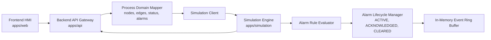

# Architecture Notes

Current MVP runtime path:

The frontend calls only `apps/api`. The simulation service remains an internal backend dependency so the API layer can normalize responses, expose fallback behavior, and later add auth, audit, rate limiting, and observability without changing the frontend contract.

The simulation engine is synthetic and deterministic. It generates telemetry for portfolio/demo workflows only and is not a real plant model.

## Process Domain Layer

`apps/api/internal/process` owns the process topology contract exposed to the frontend:

- stable process nodes such as `reactor-core`, `primary-loop`, `steam-generator`, `turbine`, `generator`, `condenser`, `feedwater-system`, and `protection-system`;
- stable process edges with flow types such as `thermal`, `primary-coolant`, `steam`, `mechanical`, `exhaust-steam`, `condensate`, `feedwater`, and `protection-signal`;
- mapper rules that attach synthetic telemetry metrics and active alarms to nodes;
- status calculation for nodes and edges;
- degraded fallback when the simulation service is unavailable.

The Process page consumes `GET /api/v1/process/topology`, not raw simulation service endpoints.

## Alarm Lifecycle Layer

`apps/simulation/internal/alarms` owns simulation-only alarm lifecycle behavior:

- alarm rules evaluate synthetic telemetry thresholds;
- lifecycle state preserves stable alarm IDs, acknowledgement metadata, occurrence count, and cleared timestamps;
- alarm events are stored in an in-memory ring buffer sized by `SIM_ALARM_EVENT_HISTORY_SIZE`;
- scenario start, scenario stop, simulation reset, alarm raise, acknowledge, clear, and reactivation produce event log entries.

`apps/api/internal/simulation` exposes these lifecycle states through gateway endpoints under `/api/v1/alarms*`. The frontend never calls `apps/simulation` directly. This keeps response normalization, timeout handling, and future auth/audit integration in the API layer.

Alarm acknowledgement in this architecture is a demo state transition inside synthetic simulation memory. It is not a real operational acknowledgement and does not trigger any real safety or control action.
