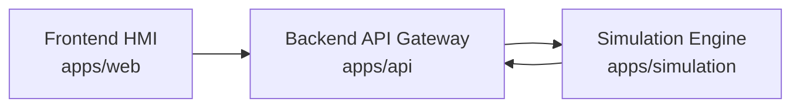
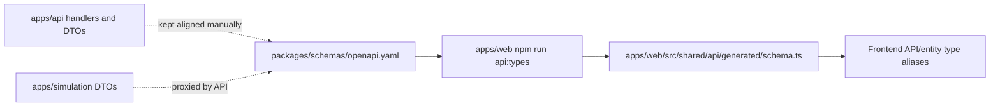
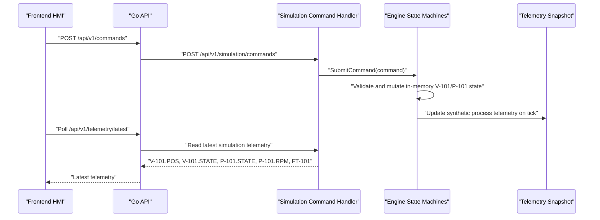
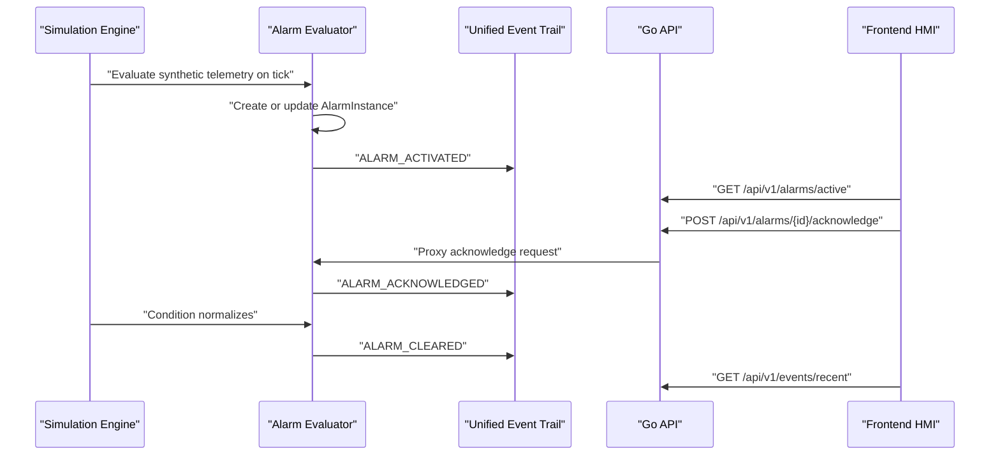

# Architecture Notes

Current MVP runtime path:

The frontend calls only `apps/api`. The simulation service remains an internal backend dependency so the API layer can normalize responses, expose fallback behavior, and later add auth, audit, rate limiting, and observability without changing the frontend contract.

The simulation engine is synthetic and deterministic. It generates telemetry for portfolio/demo workflows only and is not a real plant model.

## API Contract Layer

The current contract layer is machine-readable but intentionally lightweight:

`packages/schemas/openapi.yaml` documents implemented REST endpoints only. The frontend generated types reduce drift for core DTOs such as `Asset`, `TelemetryPoint`, `Command`, `AlarmInstance`, `Event`, `SystemStatus`, `Scenario`, and API envelopes.

This is not an OpenAPI-first backend rewrite. Go server stubs, generated Go clients, and runtime request/response validation are not implemented yet. The API gateway remains the runtime contract boundary for the frontend.

## Domain Layers

The current MVP separates domain concerns into two layers:

- `SMR Unit Overview`: high-level synthetic unit metrics for dashboard, top-level status, scenarios, and trends.
- `Thermal Process Loop MVP`: lower-level process-loop assets and tags for the HMI mnemonic and future simulation-only command layer.

The API should preserve both layers. Unit overview telemetry must not replace process-loop telemetry, and process-loop UI should prefer live API values before falling back to clearly labelled in-memory/demo values.

## Simulation Command Flow

The current command path is REST plus polling:

Command history and events are stored in an in-memory ring buffer inside `apps/simulation`. The API proxies recent command/event reads through:

- `GET /api/v1/commands/recent`
- `GET /api/v1/events/recent`

This is intentionally not a real control path. Commands mutate only in-memory simulated assets and exist to validate the digital twin interaction loop.

## Dashboard Live Overview

The Dashboard is an overview page for the local simulation platform, not a production plant operations screen.
It reads independent live API sources through REST polling:

- `GET /api/v1/system/status` for API, environment, mode, and safety boundary status.
- `GET /api/v1/telemetry/latest` for synthetic process-loop telemetry.
- `GET /api/v1/alarms/active` and `GET /api/v1/alarms/history` for active, acknowledged, and cleared alarm summaries.
- `GET /api/v1/commands/recent` for the latest simulation-only command result.
- `GET /api/v1/events/recent` for command, alarm, and simulation activity.

Each dashboard section handles loading, empty, and unavailable states independently. Remaining non-production boundaries are labelled explicitly as synthetic telemetry, in-memory storage, REST polling, and no real plant control.

The Process page reads process-loop assets through `GET /api/v1/assets` and process telemetry through `GET /api/v1/telemetry/latest`. The Trends page uses latest telemetry for summary cards and `GET /api/v1/telemetry/history` for chart data. If history is unavailable, the chart explicitly labels its static fallback curve as demo data.

## Alarm And Event Operations Flow

The current alarm workflow is also REST plus polling:

Alarm and event storage is in-memory inside `apps/simulation`. The API is a proxy boundary for the frontend and is the intended place for future auth, RBAC, rate limiting, persistent audit writes, and contract versioning.

## Current Limitations

- Live UI updates use polling, not WebSocket or SSE.
- Telemetry history is in-memory.
- Alarm lifecycle and event history are in-memory.
- Process commands are implemented only for simulated `V-101` and `P-101` assets.
- Command/event history is in-memory and not an immutable audit store.
- MQTT, TSDB persistence, PID control, report export, auth/RBAC, and Kubernetes are not part of the current milestone.
