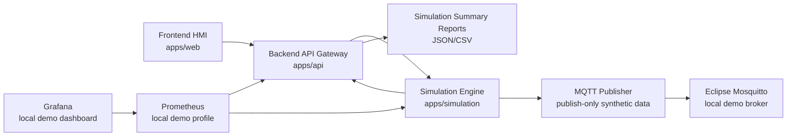
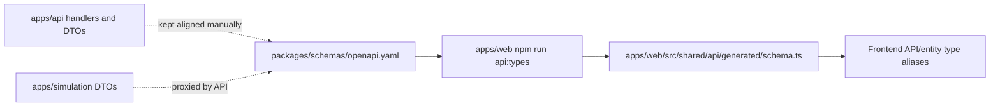
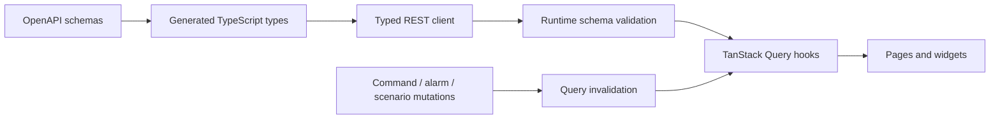
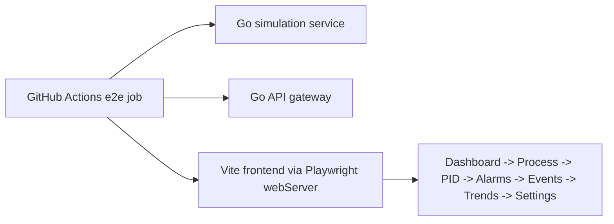
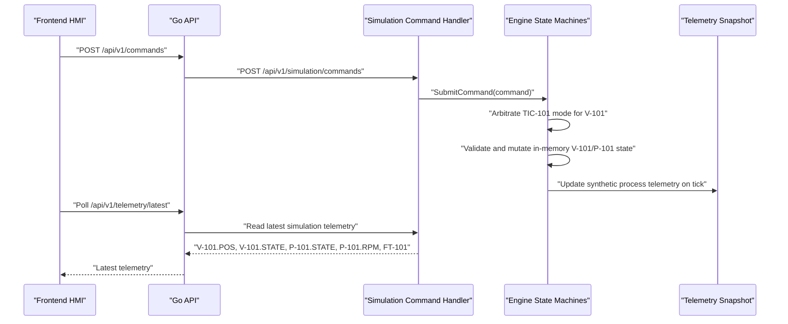
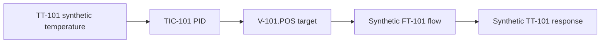
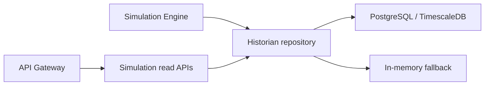
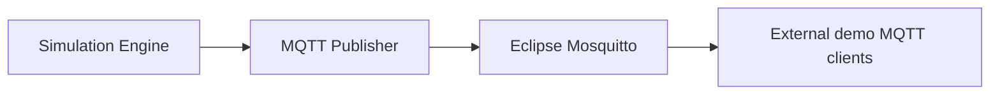
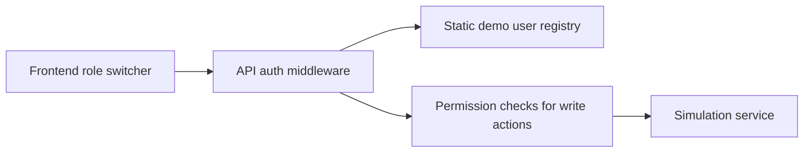
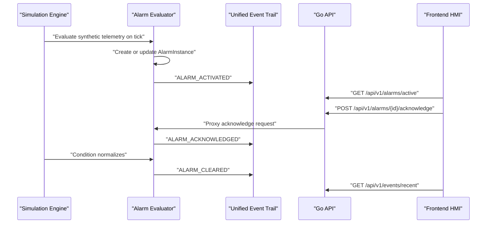

# Architecture Notes

Current MVP runtime path:

The frontend calls only `apps/api`. The simulation service remains an internal backend dependency so the API layer can normalize responses, expose fallback behavior, enforce demo RBAC for protected actions, aggregate simulation-only reports, and later add production auth hardening or rate limiting without changing the frontend contract.

The simulation engine is synthetic and deterministic. It generates telemetry for portfolio/demo workflows only and is not a real plant model.

## API Contract Layer

The current contract layer is machine-readable but intentionally lightweight:

`packages/schemas/openapi.yaml` documents implemented REST endpoints only. The frontend generated types reduce drift for core DTOs such as `Asset`, `TelemetryPoint`, `Command`, `AlarmInstance`, `Event`, `SystemStatus`, `Scenario`, and API envelopes.

CI now checks contract health in four layers: generated TypeScript output must be clean after `npm run api:types`, the OpenAPI document must parse, JSON Schema reference files must compile, and an explicit runtime-validation coverage script must still include the core API payloads. This is not an OpenAPI-first backend rewrite. Go server stubs, generated Go clients, and Go runtime validation from JSON Schema are not implemented yet. Frontend dev/test runtime validation is implemented in the typed HTTP client for selected request and response payloads. The API gateway remains the runtime contract boundary for the frontend.

## Frontend Data Layer

Frontend REST access is centralized around generated contract types, a typed HTTP client, and TanStack Query hooks:

The current live transport is still REST polling. Query intervals are set per data type: telemetry is refreshed most frequently, while system status, events, commands, alarm history, assets, and scenarios use slower refresh or cache windows. Mutations do not perform optimistic updates yet; they invalidate related query keys so the UI reflects the API and simulation state after the backend accepts the operation.

Runtime API validation is available in the frontend HTTP client for selected request and response payloads. It is controlled by `VITE_API_RUNTIME_VALIDATION=off|warn|strict`; local development defaults to `warn`, production defaults to `off`, and the CI E2E browser regression suite runs in `strict` mode. This catches contract drift between real JSON payloads and JSON Schema/OpenAPI definitions during development and tests without turning the frontend into a production security gateway.

## Browser Regression Quality Gate

The CI pipeline includes fast frontend component tests, a Playwright Chromium browser regression job for key simulator workflows, a separate Playwright visual regression job for core HMI page screenshots, a historian DB smoke job for the full Docker Compose persistence path, and an MQTT bridge smoke job for the publish-only IIoT path:

The browser regression suite verifies synthetic simulation workflows only. It covers Dashboard status visibility, manual `V-101`/`P-101` command flows, manual-to-AUTO PID arbitration, alarm activate/acknowledge/clear, Events filtering/sorting, Trends source labels, Settings capability copy, demo RBAC role flows, basic degraded historian/MQTT UI states via route mocks, axe-powered accessibility baseline checks, and keyboard navigation through the skip link, primary sidebar, and core control inputs. It does not replace deeper component tests, a full human WCAG audit, multi-browser certification, or production SCADA validation.

The visual regression suite captures deterministic fixed-viewport Playwright screenshots for Dashboard, Process, Alarms, Events, Trends, Reports, and Settings. It disables animations, fixes the demo user/theme/viewport/locale/timezone, resets the simulation before each scenario, and masks dynamic synthetic telemetry, event rows, alarm rows, report counters, and chart regions that would otherwise create noise. These screenshots guard page composition, responsive layout, sticky sidebar behavior, status badges, and card/grid integrity; they are not evidence of real plant operation or production HMI certification.

The desktop HMI layout keeps the primary sidebar as a sticky, semantic navigation region with its own overflow when needed. The main content remains separate from the sidebar, and smaller viewports fall back to the responsive static layout so navigation does not cover the simulation workspace.

Vitest and React Testing Library cover component-level rendering and interaction checks for HMI status cards, MQTT/historian labels, control mode/PID panels, valve/pump controls, alarms, event filters, Trends source badges, and Settings capability copy. These tests mock frontend hooks and fixtures; they do not perform real plant control or external integration.

The historian DB smoke runs `docker compose up --build -d` in an isolated Compose project, waits for the PostgreSQL/TimescaleDB historian to report `connected`, verifies raw telemetry and 1-minute aggregate telemetry through the API, writes a simulation-only `V-101` command, restarts the simulation service, and verifies history/command/event records survive the restart. It verifies demo persistence and downsampling of synthetic data only, not production audit compliance.

The MQTT bridge smoke runs the full Docker Compose stack with the local Mosquitto broker, waits for `GET /api/v1/mqtt/status` to report `connected`, subscribes to synthetic telemetry and command/event topics, and verifies publish-only messages. It does not create MQTT command input topics and does not control the simulator through MQTT.

Smoke and integration scripts write sanitized local diagnostic artifacts under `logs/`, including success summaries and failure details. These artifacts are local/CI troubleshooting output for synthetic simulation data only; they are not a production audit archive.

## Local Observability Baseline

API and simulation expose Prometheus metrics at:

- `GET /metrics` on `apps/api`
- `GET /metrics` on `apps/simulation`

The optional Docker Compose `observability` profile starts Prometheus and Grafana. Prometheus scrapes the API and simulation services, and Grafana provisions a local overview dashboard for API request rates/errors, simulation ticks, active alarms, historian queue health, MQTT publish counters, PID state, valve position, pump state, and command counts.

The observability smoke test (`scripts/smoke/observability-smoke.mjs`) validates that this profile actually starts, that API/simulation `/metrics` are reachable, that Prometheus is ready and scraping both targets, that key metrics can be queried, and that Grafana health is reachable.

This stack is for local demo diagnostics only. Grafana uses local demo credentials, no TLS, no production alerting, no log aggregation, and no SRE-grade retention policy.

## Domain Layers

The current MVP separates domain concerns into two layers:

- `SMR Unit Overview`: high-level synthetic unit metrics for dashboard, top-level status, scenarios, and trends.
- `Thermal Process Loop MVP`: lower-level process-loop assets and tags for the HMI mnemonic and future simulation-only command layer.

The API should preserve both layers. Unit overview telemetry must not replace process-loop telemetry, and process-loop UI should prefer live API values before falling back to clearly labelled in-memory/demo values.

## Simulation Command Flow

The current command path is REST plus polling. Direct `V-101` commands now pass through the `TIC-101` simulation-only control arbitrator before reaching the actuator state machine:

Command history and events are stored first in the simulation service and can also be written to the optional PostgreSQL/TimescaleDB historian. The API proxies recent command/event reads through:

- `GET /api/v1/commands/recent`
- `GET /api/v1/events/recent`

This is intentionally not a real control path. Commands mutate only in-memory simulated assets and exist to validate the digital twin interaction loop.

## Manual / Auto Command Arbitration

`TIC-101` currently owns the simulation-only control mode for the `TT-101 -> V-101.POS` loop:

- `MANUAL`: direct user/frontend commands to `V-101` are allowed.
- `AUTO`: `V-101` is owned by the simulation-only `TIC-101` PID controller. Direct user/frontend valve commands are rejected by arbitration.
- `DISABLED`: direct user/frontend valve commands are rejected because control output is disabled.

`P-101` remains manually controllable in this milestone. Scenario and system operations are preserved as simulation overrides. Mode changes and arbitration rejections are recorded in the unified event stream using `CONTROL_MODE_CHANGED`, `CONTROL_AUTHORITY_CHANGED`, and `COMMAND_REJECTED_BY_ARBITRATION`; these records are persisted when the historian is connected.

## TIC-101 PID Loop

`TIC-101` is a synthetic teaching controller for the thermal process loop. It is active only in `AUTO` mode:

The PID implementation includes conservative `Kp/Ki/Kd` tuning, setpoint validation, output limits from `0..100%`, integral clamping for basic anti-windup, and a startup bias from the current valve position when entering `AUTO`. It controls only in-memory simulation state and is not a real plant controller.

## Dashboard Live Overview

The Dashboard is an overview page for the local simulation platform, not a production plant operations screen.
It reads independent live API sources through REST polling:

- `GET /api/v1/system/status` for API, environment, mode, and safety boundary status.
- `GET /api/v1/telemetry/latest` for synthetic process-loop telemetry.
- `GET /api/v1/alarms/active` and `GET /api/v1/alarms/history` for active, acknowledged, and cleared alarm summaries.
- `GET /api/v1/commands/recent` for the latest simulation-only command result.
- `GET /api/v1/events/recent` for command, alarm, and simulation activity.

Each dashboard section handles loading, empty, and unavailable states independently. Remaining non-production boundaries are labelled explicitly as synthetic telemetry, optional historian/in-memory fallback storage, REST polling, and no real plant control.

The Process page reads process-loop assets through `GET /api/v1/assets` and process telemetry through `GET /api/v1/telemetry/latest`. The Trends page uses latest telemetry for summary cards and `GET /api/v1/telemetry/history` for chart data. Longer windows can request `resolution=1m` to read synthetic 1-minute aggregate history when the historian is connected. If history is unavailable, the chart explicitly labels its static fallback curve as demo data.

## Persistent Historian Layer

The optional historian stores synthetic simulation records only. It is owned by `apps/simulation`, because the simulation engine is the source of telemetry, commands, events, alarms, control mode changes, and PID events:

When `HISTORIAN_ENABLED=true` and `DATABASE_URL` is reachable, migrations run on simulation startup and the repository writes telemetry, command, event, and alarm history records. Telemetry writes also maintain a `telemetry_history_1m` aggregate table for synthetic trend downsampling, while `historian/status` exposes demo retention/downsampling metadata such as supported resolutions. If the database is disabled or unavailable, simulation continues with the existing in-memory history and exposes degraded historian status through:

- `GET /api/v1/historian/status`
- `GET /api/v1/simulation/historian/status`

The historian is not a compliance audit system. The 30-day raw retention metadata and 1-minute aggregate path apply only to synthetic simulation telemetry; they do not provide immutability, production auth/RBAC, regulatory retention, or audit guarantees.

## MQTT Bridge

The MQTT bridge is owned by `apps/simulation`, close to the synthetic telemetry, event, alarm, command, PID, control, historian, and system status sources:

It publishes JSON envelopes under the default `smr/site-001/unit-001` topic prefix, including `schemaVersion`, `publishedAt`, `source`, `simulationOnly: true`, `topicType`, and `data`. The bridge is optional, disabled by default outside Docker Compose, and exposes status through:

- `GET /api/v1/mqtt/status`
- `GET /api/v1/simulation/mqtt/status`

This is publish-only. There are no MQTT command ingestion topics, no MQTT actuator control path, and no production broker auth/ACL/TLS in the current milestone.

## Demo Auth / RBAC Layer

Demo RBAC lives in `apps/api` as the frontend-facing enforcement boundary. The HMI sends the selected static demo user with `X-Demo-User`; missing or unknown headers fall back to `demo-operator` for local demo compatibility.

The API exposes `GET /api/v1/auth/session` and `GET /api/v1/auth/users`. Write/action endpoints such as commands, control mode changes, PID config updates, alarm acknowledgement, and scenario operations require demo permissions and return structured `403 RBAC_FORBIDDEN` errors when denied.

This is not production authentication. There are no passwords, OAuth/JWT flows, persistent users, or real plant access-control guarantees. The simulation service remains a local/internal demo dependency and is not hardened as a public security boundary.

## Simulation Report Export

The API gateway aggregates existing simulation APIs into a read-only simulation summary report:

- `GET /api/v1/reports/simulation-summary?window=1h`
- `GET /api/v1/reports/simulation-summary?window=1h&format=csv`

JSON reports include a `simulationOnly: true` envelope, generation metadata, current demo user, system/historian/MQTT/control/PID status, latest telemetry, simple telemetry min/max/average summaries, and command/event/alarm counts. CSV uses a compact `section,key,value,unit,source` format for demo export workflows.

Reports use existing synthetic data sources only. They are not regulatory reports, production audit exports, nuclear compliance artifacts, or evidence of real plant operation.

## Alarm And Event Operations Flow

The current alarm workflow is also REST plus polling:

Alarm and event state is owned by `apps/simulation`. Recent records remain available from in-memory fallback and can be persisted by the optional historian. The API is a proxy boundary for the frontend and is the intended place for future auth, RBAC, rate limiting, audit policy, and contract versioning.

## Current Limitations

- Live UI updates use polling, not WebSocket or SSE.
- Telemetry, command, event, and alarm history are persistent only when the optional PostgreSQL/TimescaleDB historian is enabled and connected; otherwise they fall back to in-memory storage. The 1-minute aggregate trend path is available only when persistent historian data exists.
- Process commands are implemented only for simulated `V-101` and `P-101` assets.
- Command/event history is not an immutable audit store.
- MQTT command ingestion, production auth/RBAC, production observability, and Kubernetes are not part of the current milestone.
- Report export is JSON/CSV only and remains simulation-only; PDF/Excel and regulatory reporting are not implemented.
