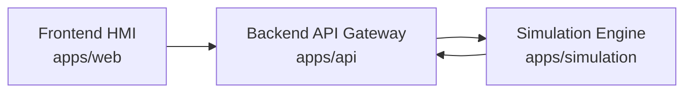

# Architecture Notes

Current MVP runtime path:

The frontend calls only `apps/api`. The simulation service remains an internal backend dependency so the API layer can normalize responses, expose fallback behavior, and later add auth, audit, rate limiting, and observability without changing the frontend contract.

The simulation engine is synthetic and deterministic. It generates telemetry for portfolio/demo workflows only and is not a real plant model.

## Domain Layers

The current MVP separates domain concerns into two layers:

- `SMR Unit Overview`: high-level synthetic unit metrics for dashboard, top-level status, scenarios, and trends.
- `Thermal Process Loop MVP`: lower-level process-loop assets and tags for the HMI mnemonic and future simulation-only command layer.

The API should preserve both layers. Unit overview telemetry must not replace process-loop telemetry, and process-loop UI should prefer live API values before falling back to local mock values.

## Current Limitations

- Live UI updates use polling, not WebSocket or SSE.
- Telemetry history is in-memory.
- Active alarms are generated and displayed, but acknowledgement and cleared history are planned.
- Process commands are intentionally disabled until a simulation-only command API is implemented.
- MQTT, TSDB persistence, PID control, report export, auth/RBAC, and Kubernetes are not part of the current milestone.
