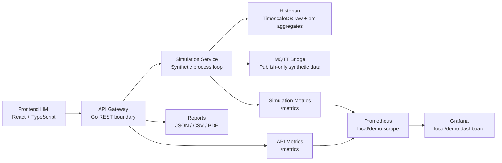
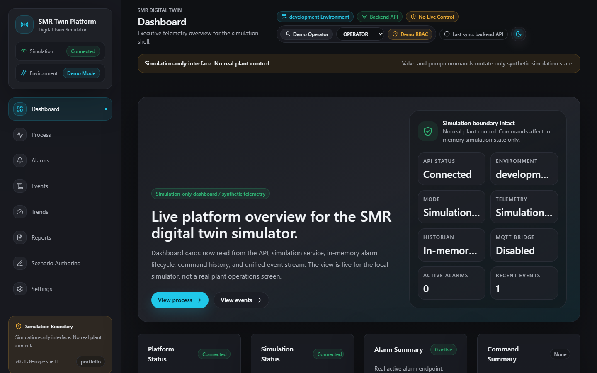
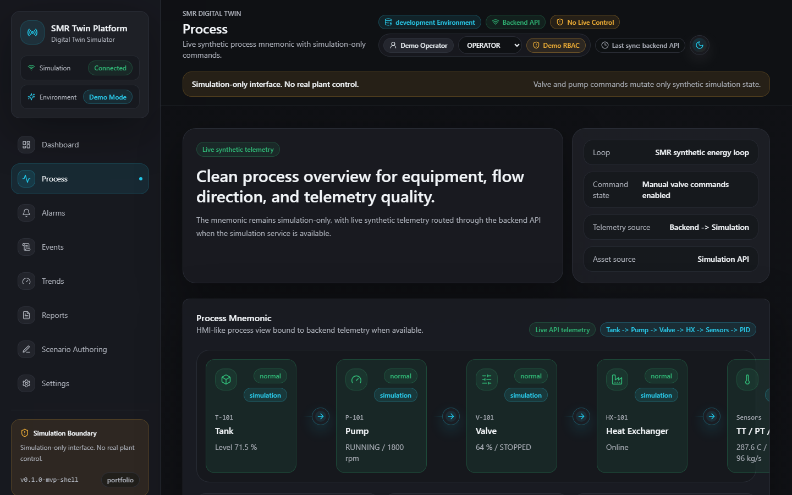
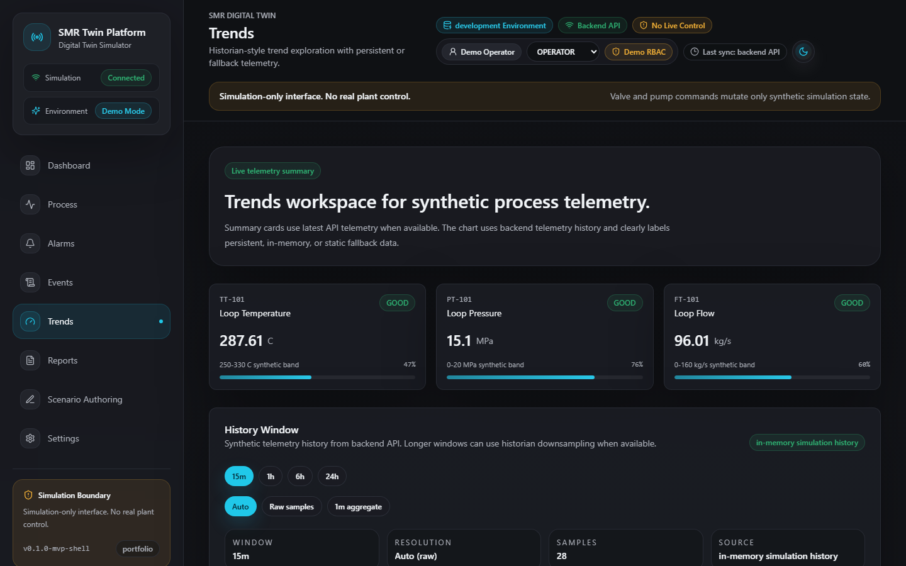
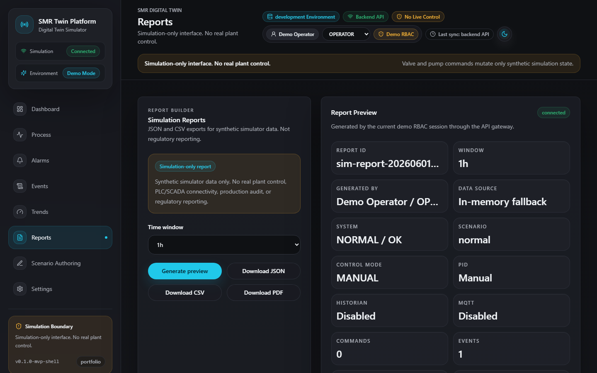
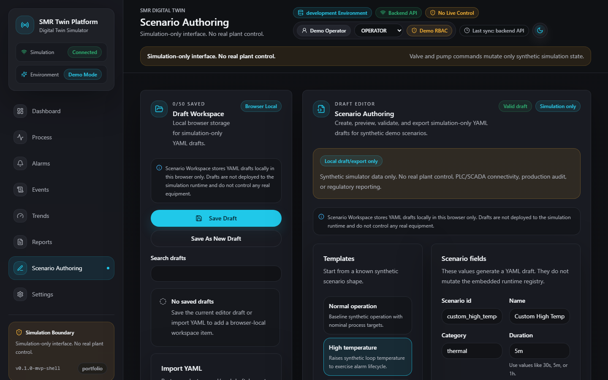
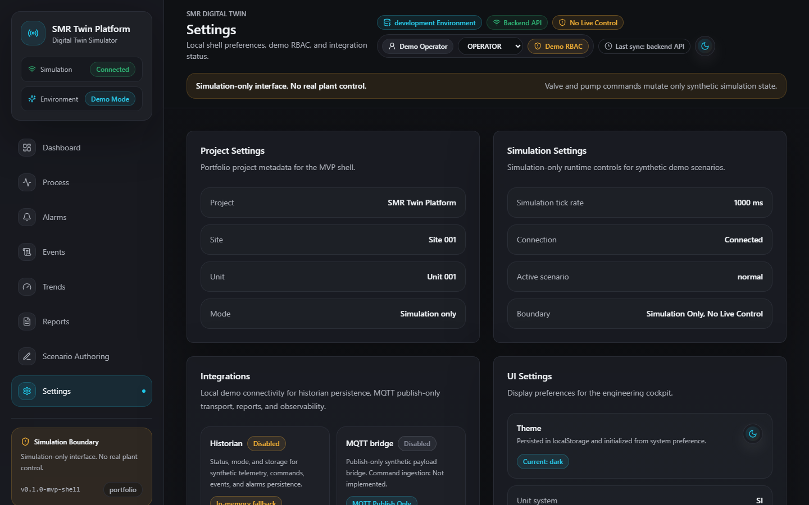

# Recruiter Case Study: SMR Digital Twin Platform

## 1. One-minute summary

SMR Digital Twin Platform is a simulation-only IIoT / Digital Twin portfolio project for a synthetic SMR-style thermal process loop. It demonstrates an industrial HMI, Go API gateway, Go simulation service, historian storage, MQTT publish-only integration, JSON/CSV/PDF reports, local/demo observability, and CI/testing discipline in one cohesive system. The project uses synthetic telemetry and in-memory simulation state only, so it can show realistic industrial software workflows without connecting to real equipment. It covers frontend architecture, backend API design, command arbitration, PID behavior, alarm lifecycle, event streams, time-series history, reporting, observability, and contract tooling. It is valuable as a portfolio project because it is not just a static UI: it includes services, tests, smokes, screenshots, documentation, safety boundaries, and a repeatable local demo. The system is explicitly not a real plant control system, not production SCADA, and not regulatory reporting.

## 2. Problem

Industrial software systems often need clear operator workflows, safe command handling, telemetry history, alarm/event records, reporting, integration protocols, observability, and a testable architecture. Those concerns are difficult to demonstrate in a portfolio because real plant integration is unsafe, unavailable, and inappropriate without a controlled industrial environment.

This project solves the portfolio problem by simulating the architecture and workflows while avoiding real equipment control. It gives reviewers a credible engineering surface to inspect without implying nuclear operations, PLC/SCADA connectivity, or production plant authority.

## 3. Solution

The solution is a simulation-only digital twin platform that models synthetic thermal process telemetry and operator-style workflows. It includes a `V-101` valve, `P-101` pump, `TIC-101` PID controller, `MANUAL`/`AUTO`/`DISABLED` modes, synthetic alarms, events, historian persistence, MQTT publishing, report export, observability, and YAML scenario configuration.

All data is synthetic. Commands mutate simulation state only. There is no PLC/SCADA connectivity, no real plant control, no physical actuator path, and no MQTT command ingestion.

## 4. Architecture overview

- **Frontend HMI**: operator-style interface for Dashboard, Process, Alarms, Events, Trends, Reports, Settings, and Scenario Authoring.
- **API Gateway**: demo RBAC, API contracts, report endpoints, proxy boundary, and normalized responses for the frontend.
- **Simulation Service**: synthetic telemetry, commands, PID, scenarios, alarms, events, historian writes, MQTT publishing, and metrics.
- **Historian**: PostgreSQL/TimescaleDB storage for synthetic raw telemetry and 1-minute aggregate history.
- **MQTT**: publish-only bridge for synthetic telemetry, status, alarm, event, and command-history messages.
- **Reports**: JSON/CSV/PDF simulation summaries that are not regulatory or production audit reports.
- **Observability**: local/demo Prometheus and Grafana stack for platform diagnostics, not production monitoring.

## 5. Key engineering highlights

| Area                       | What was built                                                                                 | Why it matters                                                                                        |
| -------------------------- | ---------------------------------------------------------------------------------------------- | ----------------------------------------------------------------------------------------------------- |
| Frontend HMI               | React HMI with dashboard, process mnemonic, trends, reports, settings, and scenario authoring  | Shows user-facing industrial workflow and responsive UI discipline.                                   |
| API Gateway                | Go REST gateway with demo RBAC, report aggregation, contracts, and simulation proxying         | Separates frontend concerns from simulation internals and enforces protected actions at one boundary. |
| Simulation Engine          | Synthetic thermal process loop with telemetry, commands, scenarios, alarms, and events         | Demonstrates state-machine thinking without controlling real equipment.                               |
| Manual/Auto/PID Control    | `MANUAL`, `AUTO`, `DISABLED`, and `TIC-101` PID arbitration for simulation-only valve behavior | Shows control workflow modeling and authority separation.                                             |
| Alarm Lifecycle            | Active/history alarms with acknowledge and clear paths                                         | Demonstrates operator response flows and event traceability.                                          |
| Event Stream               | Unified synthetic events and command history                                                   | Helps reviewers see cause/effect across commands, scenarios, and alarms.                              |
| Historian                  | Raw synthetic telemetry plus 1-minute aggregate history                                        | Demonstrates time-series persistence and trend querying.                                              |
| MQTT Bridge                | Publish-only synthetic telemetry/events/status bridge                                          | Shows IIoT integration while explicitly avoiding MQTT command ingestion.                              |
| Reports                    | JSON/CSV/PDF simulation summary exports                                                        | Provides demo artifacts without claiming regulatory reporting.                                        |
| Scenario Authoring         | UI for YAML draft creation, preview, validation, copy, and download                            | Demonstrates productivity tooling while avoiding runtime deployment from the UI.                      |
| Observability              | API/simulation metrics, Prometheus scrape, Grafana dashboard, smoke validation                 | Shows operational awareness for a local/demo stack.                                                   |
| Contracts                  | OpenAPI, JSON Schema, generated TypeScript, runtime validation, drift checks                   | Reduces API/frontend mismatch risk.                                                                   |
| Testing/CI                 | Unit/component/E2E/a11y/visual/smoke/load/security/repo hygiene checks                         | Makes the demo continuously verifiable rather than screenshot-only.                                   |
| Security / Safety Boundary | Demo RBAC and explicit simulation-only disclaimers                                             | Keeps the project honest about what it does and does not prove.                                       |

## 6. Operator workflow demo

1. Open Dashboard.
2. Check system, historian, MQTT, report, and observability states.
3. Go to Process.
4. Send `V-101` and `P-101` simulation commands.
5. Switch `MANUAL` / `AUTO` mode.
6. Observe `TIC-101` PID behavior.
7. Trigger a synthetic scenario.
8. Acknowledge synthetic alarms.
9. Review Events.
10. Review Trends with raw and 1-minute historian data.
11. Export JSON/CSV/PDF simulation reports.
12. Open Scenario Authoring and export a YAML draft.

This flow is suitable for a 3-5 minute interview walkthrough because it touches frontend, backend, simulation, historian, reports, safety boundaries, and CI evidence.

## 7. Screenshots

Final demo screenshots are committed under `docs/assets/screenshots/`.

## 8. Quality and reliability discipline

The project includes repository hygiene checks, pre-commit/pre-push workflow, Go tests/vet/race/coverage in CI, frontend format/typecheck/lint/build, component tests, E2E tests, Chromium + Firefox multi-browser smoke, accessibility checks, keyboard navigation checks, visual regression, historian DB smoke, MQTT smoke, observability smoke, load-and-soak baseline, security/dependency scans, and OpenAPI/schema/generated TypeScript drift checks.

This matters because the project is not just a UI demo. It is engineered as a small multi-service platform with contracts, automated verification, generated artifact guards, and smoke coverage for the integration paths it claims to demonstrate.

## 9. Safety boundary

| Claim                                        | Status |
| -------------------------------------------- | ------ |
| Controls real equipment                      | No     |
| Connects to PLC/SCADA                        | No     |
| Uses synthetic telemetry                     | Yes    |
| MQTT command ingestion                       | No     |
| Production auth                              | No     |
| Demo RBAC                                    | Yes    |
| Regulatory reporting                         | No     |
| Simulation reports                           | Yes    |
| Local/demo observability                     | Yes    |
| Scenario Authoring deploys runtime scenarios | No     |
| Scenario Authoring exports YAML drafts       | Yes    |

The project is simulation-only. It does not validate real plant control, safety-critical behavior, production monitoring, regulatory performance, or certified nuclear operations.

## 10. What this project demonstrates about the developer

- Ability to design and package a multi-service system.
- Frontend architecture and UI discipline for operator-style workflows.
- Go backend/API development with clear service boundaries.
- Simulation and state-machine thinking for commands, PID, scenarios, alarms, and events.
- Industrial workflow awareness without overclaiming real plant experience.
- API contract discipline across OpenAPI, JSON Schema, generated TypeScript, and runtime validation.
- Testing culture across unit, component, E2E, a11y, keyboard, visual, smoke, and load checks.
- CI/CD discipline with quality gates and artifact guards.
- Safety-conscious engineering and documentation.
- Ability to make a project understandable for recruiters, hiring managers, and technical interviewers.

## 11. Technologies used

Frontend:

- React
- TypeScript
- Vite
- Tailwind
- TanStack Query
- Playwright
- Vitest / React Testing Library

Backend:

- Go
- REST API
- Structured middleware
- Demo RBAC layer

Simulation / industrial:

- Synthetic telemetry
- PID
- State machines
- Alarms/events
- YAML scenarios

Data / integrations:

- PostgreSQL / TimescaleDB
- MQTT
- Prometheus
- Grafana

Contracts / quality:

- OpenAPI
- JSON Schema
- Generated TypeScript
- Runtime validation
- CI quality gates

## 12. Known limitations

- Simulation-only data and actions.
- No real plant control.
- No PLC/SCADA connectivity.
- No production authentication.
- No production audit immutability.
- No MQTT command ingestion.
- No regulatory reports or nuclear compliance reports.
- Scenario Authoring exports YAML drafts only and does not deploy runtime scenarios.
- Observability is local/demo only.

## 13. Next improvements

- Scenario Authoring save workspace for local drafts only.
- Report template customization for simulation-only, non-regulatory summaries.
- OpenAPI-generated Go client to reduce API contract drift.
- Recruiter case study assets for easier hiring-manager review.
- Load profile threshold hardening from repeated CI/load-soak runs.
- Scenario authoring backend validation if it remains validation-only and does not persist or deploy runtime scenarios.

## 14. Interview talking points

- "Why simulation-only?"
- "How API contracts are kept stable."
- "How command arbitration works."
- "How PID is isolated from manual commands."
- "How historian raw/aggregate data works."
- "How MQTT is publish-only."
- "How CI catches regressions."
- "How Scenario Authoring avoids unsafe runtime deployment."
